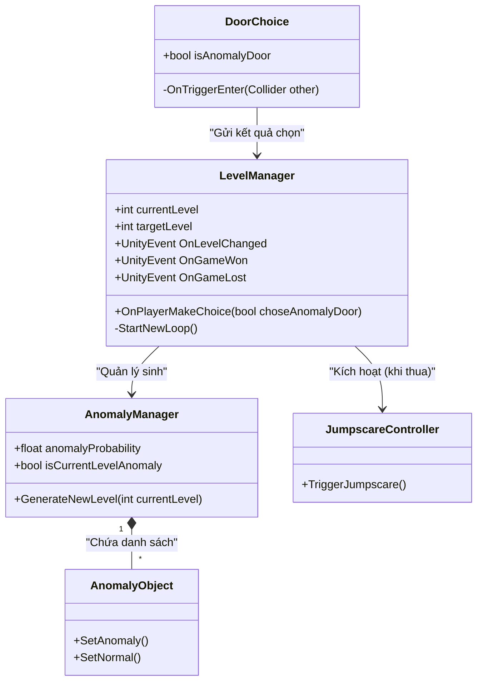

# BÁO CÁO DỰ ÁN: GAME 3D GIẢI ĐỐ TÌM ĐIỂM BẤT THƯỜNG (ANOMALY DETECTION)

## 1. Giới thiệu đề tài
- **Tên đề tài:** Xây dựng trò chơi 3D giải đố góc nhìn thứ nhất với cơ chế nhận diện điểm bất thường.
- **Thể loại:** Puzzle (Giải đố), Psychological Horror (Kinh dị tâm lý), Walking Simulator.
- **Nền tảng:** PC và Mobile (hỗ trợ màn hình cảm ứng).
- **Mô tả lối chơi (Gameplay):** Lấy cảm hứng từ tựa game nổi tiếng "The Exit 8", người chơi sẽ bị mắc kẹt trong một không gian vòng lặp (hành lang, căn phòng). Mỗi khi bắt đầu một vòng lặp mới, môi trường sẽ có xác suất xuất hiện một điểm bất thường (Anomaly). Nhiệm vụ của người chơi là phải quan sát thật kỹ và đưa ra quyết định:
  - Nếu phát hiện có điểm bất thường: Chọn đi vào cửa/hướng báo hiệu sự bất thường.
  - Nếu môi trường hoàn toàn bình thường: Chọn đi vào cửa/hướng an toàn.
- **Mục tiêu:** Mỗi lần chọn đúng, cấp độ (Level) sẽ tăng lên. Trò chơi kết thúc khi người chơi sống sót và đạt được cấp độ tối đa (Level 8). Nếu đưa ra quyết định sai, cấp độ sẽ bị đặt lại về 0, và người chơi có thể phải đối mặt với các yếu tố kinh dị (Jumpscare).

---

## 2. Tính cấp thiết của đề tài
- **Đáp ứng nhu cầu giải trí & xu hướng thị trường:** Thể loại game "Spot the Difference" (tìm điểm khác biệt) kết hợp yếu tố kinh dị sinh tồn đang tạo ra một sức hút rất lớn trong cộng đồng game thủ quốc tế (ví dụ: I'm on Observation Duty, The Exit 8). Việc phát triển một sản phẩm tương tự nhưng tối ưu hóa cho nền tảng Mobile giúp lấp đầy khoảng trống thị trường cho các dòng game giải đố kinh dị chất lượng trên điện thoại.
- **Rèn luyện kỹ năng cho người chơi:** Trò chơi đòi hỏi sự tập trung cao độ, khả năng ghi nhớ chi tiết, kỹ năng quan sát nhạy bén và phân tích logic.
- **Góc độ nghiên cứu và ứng dụng kỹ thuật:** Đồ án là cơ sở thực tiễn để nghiên cứu, áp dụng và làm chủ các kỹ thuật cốt lõi trong quy trình phát triển game 3D: Thiết kế hệ thống sinh ngẫu nhiên có kiểm soát (RNG), xây dựng kiến trúc phân tách chức năng (Decoupled Architecture) thông qua Event System, và tối ưu hóa hệ thống điều khiển đa nền tảng (Cross-platform Input).

---

## 3. Mô tả chi tiết về các công nghệ sử dụng

Dự án được phát triển dựa trên các công nghệ và kỹ thuật sau:

- **Engine Phát triển (Game Engine): Unity 3D**
  - Là nền tảng đồ họa và vật lý cốt lõi của dự án. Unity cung cấp khả năng render 3D mạnh mẽ, quản lý ánh sáng (Lighting), và đặc biệt hỗ trợ Build đa nền tảng cực kỳ linh hoạt từ PC sang Android/iOS.
  
- **Ngôn ngữ Lập trình: C# (C-Sharp)**
  - Sử dụng OOP (Lập trình hướng đối tượng) để xây dựng các kịch bản logic (Script). Cấu trúc mã nguồn được chia thành các hệ thống riêng biệt như `AnomalySystem`, `UI`, `Mobile` giúp dễ dàng bảo trì và mở rộng.

- **Hệ thống Quản lý Bất thường (Anomaly System)**
  - **Sinh ngẫu nhiên có trọng số:** Cốt lõi của game nằm ở thuật toán xác định xem màn chơi hiện tại có xuất hiện sự bất thường hay không dựa trên tỷ lệ phần trăm (Probability). Hệ thống được lập trình để ngăn chặn tình trạng lặp lại một kết quả quá nhiều lần (ví dụ: ép buộc xuất hiện Anomaly nếu đã qua 2 phòng bình thường liên tiếp).
  - **Quản lý danh sách (List Management):** Các sự kiện bất thường được lưu trong danh sách và sẽ bị loại bỏ tạm thời sau khi xuất hiện, đảm bảo người chơi không gặp lại cùng một hiện tượng trong một chu kỳ chơi.

- **Hệ thống điều khiển Mobile (Mobile Input System)**
  - Tự phát triển các component nhận diện cảm ứng bao gồm: `MobileJoystick` (để di chuyển nhân vật), `MobileTouchCamera` (nhận diện thao tác vuốt trên nửa màn hình để xoay góc nhìn) và `MobileButtons` (các nút chức năng UI).

- **Hệ thống Lưu trữ (Data Persistence)**
  - Tích hợp `PlayerPrefs` của Unity để ghi nhớ tiến độ của người chơi (Level hiện tại). Nếu người chơi thoát ứng dụng giữa chừng, dữ liệu vẫn được bảo toàn cho lần chơi tiếp theo.

- **Hệ thống Sự kiện (Event-Driven Architecture)**
  - Thay vì để các lớp phụ thuộc cứng vào nhau (Tight Coupling), dự án sử dụng `UnityEvent` (`OnLevelChanged`, `OnGameWon`, `OnGameLost`). Điều này giúp Level Manager chỉ cần phát rập tín hiệu, các hệ thống khác (UI, Âm thanh, Jumpscare) sẽ tự động lắng nghe và phản hồi, làm mã nguồn sạch và an toàn hơn.

---

## 4. Danh mục sơ đồ UML

Dưới đây là danh mục các sơ đồ UML quan trọng được thiết kế để chuẩn hóa kiến trúc dự án:

### 4.1. Sơ đồ Use Case (Use Case Diagram)
Mô tả các hành động mà người chơi có thể tương tác với hệ thống.

```mermaid
usecaseDiagram
    actor Player as "Người chơi"
    
    usecase UC1 as "Bắt đầu/Tiếp tục trò chơi"
    usecase UC2 as "Di chuyển & Xoay góc nhìn"
    usecase UC3 as "Quan sát môi trường"
    usecase UC4 as "Chọn Cửa (Đưa ra quyết định)"
    usecase UC5 as "Tạm dừng & Tùy chỉnh (Pause/Settings)"

    Player --> UC1
    Player --> UC2
    Player --> UC3
    Player --> UC4
    Player --> UC5
```

### 4.2. Sơ đồ Lớp (Class Diagram)
Mô tả cấu trúc tĩnh của các đoạn mã (Script) và mối quan hệ kết nối giữa các hệ thống chính trong game.



### 4.3. Sơ đồ Hoạt động (Activity Diagram) - Vòng lặp Gameplay
Mô tả quy trình logic một vòng lặp của màn chơi từ khi sinh ra môi trường cho đến khi người chơi chọn cửa.

```mermaid
flowchart TD
    Start((Bắt đầu Loop)) --> A[Đưa người chơi về điểm xuất phát]
    A --> B{Sinh Anomaly?}
    B -->|Có (Random/Ép buộc)| C[Kích hoạt 1 Anomaly ngẫu nhiên]
    B -->|Không| D[Giữ môi trường bình thường]
    C --> E[Người chơi khám phá hành lang]
    D --> E
    E --> F[Người chơi tương tác/Đi qua cửa]
    F --> G{Lựa chọn đúng?}
    
    G -->|ĐÚNG| H[Tăng Level +1]
    H --> I{Đạt Level Max?}
    I -->|Rồi| J((CHIẾN THẮNG))
    I -->|Chưa| Start
    
    G -->|SAI| K[Reset Level = 0]
    K --> L[Kích hoạt Jumpscare]
    L --> Start
```
