# TÀI LIỆU PHÂN TÍCH CHỨC NĂNG HỆ THỐNG VÀ CÁC SƠ ĐỒ UML
## DỰ ÁN: GAME 3D GIẢI ĐỐ TÌM ĐIỂM BẤT THƯỜNG (ANOMALY DETECTION)

Tài liệu này cung cấp cái nhìn toàn diện về cấu trúc chức năng hệ thống (System Functions) và hệ thống sơ đồ UML (Unified Modeling Language) cốt lõi mô tả kiến trúc phần mềm, luồng nghiệp vụ và cách tương tác giữa các thành phần mã nguồn thực tế của dự án (`AnomalySystem`, `RoomSystem`, `Gameplay`, `UI`, `Shared`).

---

## MỤC LỤC
1. [PHẦN I: DANH SÁCH CHỨC NĂNG HỆ THỐNG](#phan-i-danh-sach-chuc-nang-he-thong)
    - 1.1. [Hệ thống Quản lý Tiến trình Phòng (Room Management Subsystem)](#11-he-thong-quan-ly-tien-trinh-phong-room-management-subsystem)
    - 1.2. [Hệ thống Dị thường & Vòng lặp Cốt lõi (Anomaly & Core Loop Subsystem)](#12-he-thong-di-thuong-vong-lap-cot-loi-anomaly-core-loop-subsystem)
    - 1.3. [Hệ thống AI Quái vật & Rượt đuổi (Monster AI & Chase Subsystem)](#13-he-thong-ai-quai-vat-ruot-duoi-monster-ai-chase-subsystem)
    - 1.4. [Hệ thống Tương tác & Thu thập Manh mối (Interactive & Inventory Subsystem)](#14-he-thong-tuong-tac-thu-thap-manh-moi-interactive-inventory-subsystem)
    - 1.5. [Hệ thống Điều khiển & Nhập liệu Đa nền tảng (Input Subsystem)](#15-he-thong-dieu-khien-nhap-lieu-da-nen-tang-input-subsystem)
    - 1.6. [Hệ thống Đồng bộ Dữ liệu & Lưu trữ (Firebase & Persistence Subsystem)](#16-he-thong-dong-bo-du-lieu-luu-tru-firebase-persistence-subsystem)
    - 1.7. [Hệ thống Giao diện & Hiệu ứng Chuyển cảnh (UI & Visual Transitions Subsystem)](#17-he-thong-giao-dien-hieu-ung-chuyen-canh-ui-visual-transitions-subsystem)
    - 1.8. [Hệ thống Quản lý Âm thanh & Tiếng chân Thực tế (Audio & Footsteps Subsystem)](#18-he-thong-quan-ly-am-thanh-tieng-chan-thuc-te-audio-footsteps-subsystem)
    - 1.9. [Hệ thống Hội thoại & Độc thoại Nội tâm (Inner Monologue & Narrative Subsystem)](#19-he-thong-hoi-thoai-doc-thoai-noi-tam-inner-monologue-narrative-subsystem)
    - 1.10. [Hệ thống Điều phối Cảnh chơi & Sự kiện Kịch bản (Level Starters & Custom Events Subsystem)](#110-he-thong-dieu-phoi-canh-choi-su-kien-kich-ban-level-starters-custom-events-subsystem)
2. [PHẦN II: HỆ THỐNG SƠ ĐỒ UML CHI TIẾT](#phan-ii-he-thong-so-do-uml-chi-tiet)
    - 2.1. [Sơ đồ Use Case Chi tiết & Đầy đủ (Use Case Diagram & Specifications)](#21-so-do-use-case-chi-tiet-day-du-use-case-diagram-specifications)
        - 2.1.1. [Sơ đồ Use Case Tổng quan (Global Use Case Diagram)](#211-so-do-use-case-tong-quan-global-use-case-diagram)
        - 2.1.2. [Sơ đồ Use Case Phân hệ Giải đố & Dị thường (Core & Anomaly Subsystem)](#212-so-do-use-case-phan-he-giai-do-di-thuong-core-anomaly-subsystem)
        - 2.1.3. [Sơ đồ Use Case Phân hệ Tương tác & Túi đồ (Interaction & Inventory Subsystem)](#213-so-do-use-case-phan-he-tuong-tac-tui-do-interaction-inventory-subsystem)
        - 2.1.4. [Sơ đồ Use Case Phân hệ AI Quái vật & Rượt đuổi (Monster AI & Chase Subsystem)](#214-so-do-use-case-phan-he-ai-quai-vat-ruot-duoi-monster-ai-chase-subsystem)
        - 2.1.5. [Sơ đồ Use Case Phân hệ Giao diện & Đồng bộ Dữ liệu (UI & Cloud Storage Subsystem)](#215-so-do-use-case-phan-he-giao-dien-dong-bo-du-lieu-ui-cloud-storage-subsystem)
        - 2.1.6. [Bảng Đặc tả chi tiết các Use Case quan trọng](#216-bang-dac-ta-chi-tiet-cac-use-case-quan-trong)
    - 2.2. [Sơ đồ Lớp (Class Diagram)](#22-so-do-lop-class-diagram)
    - 2.3. [Sơ đồ Hoạt động Vòng lặp Gameplay (Activity Diagram - Core Loop)](#23-so-do-hoat-dong-vong-lap-gameplay-activity-diagram-core-loop)
    - 2.4. [Sơ đồ Tuần tự Xử lý Lựa chọn (Sequence Diagram - Door Choice Validation)](#24-so-do-tuan-tu-xu-ly-lua-chon-sequence-diagram-door-choice-validation)
    - 2.5. [Sơ đồ Trạng thái AI Quái vật (State Diagram - Demon AI FSM)](#25-so-do-trang-thai-ai-quai-vat-state-diagram-demon-ai-fsm)
    - 2.6. [Sơ đồ Kiến trúc Thành phần Component (Component-Based Architecture Diagram)](#26-so-do-kien-truc-thanh-phan-component-component-based-architecture-diagram)
    - 2.7. [Sơ đồ Luồng Điều hướng Giao diện (UI Flow Diagram)](#27-so-do-luong-dieu-huong-giao-dien-ui-flow-diagram)
    - 2.8. [Sơ đồ Luồng Lưu trữ Dữ liệu Firebase (Firebase Integration Data Flow)](#28-so-do-luong-luu-tru-du-lieu-firebase-firebase-integration-data-flow)

---

# PHẦN I: DANH SÁCH CHỨC NĂNG HỆ THỐNG

Dự án được xây dựng theo kiến trúc hướng thành phần (Component-Based Architecture) kết hợp chặt chẽ với mô hình hướng sự kiện (Event-Driven Architecture) nhằm phân tách (decouple) mã nguồn, giúp nâng cao tính bảo trì và khả năng mở rộng. Dưới đây là mô tả chi tiết của từng phân hệ chức năng:

```
📦 Assets/Scripts
 ┣ 📂 AnomalySystem     # Hệ thống quản lý dị thường, cấp độ và tương tác cửa
 ┣ 📂 RoomSystem        # Hệ thống quản lý chuyển cảnh và vị trí phòng 0-5
 ┣ 📂 Gameplay          # Hệ thống AI quái vật, rượt đuổi, cửa vật lý
 ┣ 📂 UI                # Giao diện chính, menu tạm dừng, ending, inventory UI
 ┣ 📂 Shared            # Thành phần dùng chung (hiệu ứng phát sáng vật phẩm)
 ┗ 📜 FirebaseDatabaseManager.cs  # Đồng bộ thông tin người chơi lên Firebase Cloud
```

---

### 1.1. Hệ thống Quản lý Tiến trình Phòng (Room Management Subsystem)
Hệ thống chịu trách nhiệm điều phối toàn bộ tiến trình di chuyển của người chơi qua các phòng chuyên biệt (Room 0 đến Room 5). Phân hệ này tự động hóa việc đồng bộ hóa dữ liệu vị trí người chơi và chuyển đổi mượt mà giữa các Scene trong Unity.

* **Các Script Core:** `RoomManager.cs` (Singleton), `PlayerTracker.cs` (Singleton), `HospitalSceneManager.cs`, `Room5Initializer.cs`, `RoomTrigger.cs`.
* **Chức năng chi tiết:**
    * **Quản lý chuyển cảnh chéo (Cross-Scene Transition):** Tự động phát hiện và chuyển scene khi người chơi bước qua cửa chuyển phòng.
        * `SampleScene`: Chứa Room 0, Room 1, Room 2.
        * `Hospital`: Chứa Room 3, Room 4.
        * `LevelTst`: Chứa Room 5.
    * **Dịch chuyển thông minh (Smart Teleportation):** Chức năng `TeleportPlayer` sử dụng kỹ thuật Raycast từ trên xuống mặt sàn vật lý thực tế để tính toán tọa độ Y chính xác (+0.02m dự phòng). Cơ chế này giúp triệt tiêu hoàn toàn lỗi người chơi bị lún sâu xuống lòng sàn (gây kẹt vật lý) hoặc rơi tự do từ trên cao.
    * **Chuyển phòng kết hợp hiệu ứng tối màn hình (Fade Transition):** Kích hoạt luồng Coroutine tạo Canvas màu đen đè lên toàn màn hình, thực hiện dịch chuyển người chơi và camera ẩn dưới màn đen, sau đó sáng màn hình trở lại dần dần để tạo cảm giác điện ảnh, mượt mà.
    * **Dọn dẹp bản sao âm thanh (Audio Listener Cleanup):** Tự động phát hiện và vô hiệu hóa các component `AudioListener` bị dư thừa hoặc trùng lặp khi khởi chạy hoặc chuyển Scene mới, đảm bảo trong game luôn chỉ tồn tại duy nhất 1 AudioListener hoạt động trên Camera của Player chính chủ.
    * **Hệ thống theo dõi và phân tích vị trí (Player Tracker System):** Sử dụng lớp `PlayerTracker` hoạt động dưới mô hình Singleton để liên tục ghi nhận lịch sử vị trí thời gian thực của người chơi:
        * *Bám đuổi trễ (-1s Delayed Position Tracking):* Ghi nhận tọa độ di chuyển vào một hàng đợi (Queue) và cung cấp vị trí trễ chính xác **1.0 giây trước** của người chơi để quái vật rượt đuổi. Điều này tạo cơ hội cho người chơi lách góc tường, né tránh và cắt đuôi quái vật một cách chiến thuật đầy hồi hộp.
        * *Học tập điểm nóng tuần tra (Dynamic Hotspots Learning):* Tự động tính toán các vùng mà người chơi đứng lâu hoặc đi lại nhiều nhất (bán kính 5 mét), sắp xếp độ ưu tiên theo tần suất lưu lại (`visitCount`). Các điểm nóng này sẽ được quái vật truy vấn động để làm điểm tuần tra ưu tiên khi không có waypoints cố định.

---

### 1.2. Hệ thống Dị thường & Vòng lặp Cốt lõi (Anomaly & Core Loop Subsystem)
Đây là cốt lõi của gameplay mang phong cách "Spot the Difference". Hệ thống điều phối sự xuất hiện của các dị thường môi trường và kiểm tra tính đúng đắn trong các quyết định của người chơi.

* **Các Script Core:** `LevelManager.cs`, `AnomalyManager.cs`, `AnomalyObject.cs`, `DoorChoice.cs`, `RoomExitTrigger.cs`.
* **Chức năng chi tiết:**
    * **Sinh ngẫu nhiên dị thường có kiểm soát:** `AnomalyManager` sinh ngẫu nhiên dị thường dựa trên tỉ lệ phần trăm thiết lập (`anomalyProbability`). Đồng thời tích hợp thuật toán thông minh ngăn chặn sự lặp lại quá nhiều lần (ví dụ: ép buộc xuất hiện dị thường nếu người chơi đã đi qua 2 phòng bình thường liên tiếp).
    * **Quản lý trạng thái dị thường (Anomaly State Controller):** Mỗi đối tượng dị thường (`AnomalyObject`) được thiết kế hai trạng thái: `SetNormal()` (Trạng thái môi trường mặc định bình thường) và `SetAnomaly()` (Kích hoạt biến đổi dị thường: thay đổi vật liệu, dịch chuyển vật thể, kích hoạt âm thanh kỳ quái).
    * **Xác thực quyết định đi qua cửa (Door Choice Detection):** Khi người chơi bước qua Collider Trigger của các cửa (`DoorChoice`), hệ thống sẽ gửi dữ liệu `isForwardDoor` (cửa đi tiếp) hoặc `isAnomalyDoor` (cửa dị thường) về `LevelManager`:
        * *Lựa chọn ĐÚNG* (Không có dị thường + Chọn đi tiếp, HOẶC Có dị thường + Chọn quay lại): Tăng cấp độ (`currentLevel++`), phát sự kiện cập nhật giao diện, và chuẩn bị sinh vòng lặp tiếp theo.
        * *Lựa chọn SAI* (Có dị thường nhưng vẫn đi tiếp, HOẶC Không có dị thường lại chọn quay lại): Reset cấp độ về 0 (`currentLevel = 0`), kích hoạt jumpscare hù dọa ngẫu nhiên và đưa người chơi về điểm xuất phát.
    * **Lưu giữ tiến trình bền vững (Persistence):** Tự động đồng bộ hóa cấp độ hiện tại của người chơi vào `PlayerPrefs` mỗi khi có thay đổi để phục vụ việc lưu màn chơi tự động.

---

### 1.3. Hệ thống AI Quái vật & Rượt đuổi (Monster AI & Chase Subsystem)
Nhằm tăng tính kinh dị và tạo áp lực thời gian cho người chơi ở các phòng nâng cao (đặc biệt là Room 4 và Room 5), hệ thống quái vật AI được đưa vào vận hành với khả năng phát hiện và rượt đuổi người chơi một cách thông minh, kết hợp các giải pháp sửa kẹt tự động (Self-Healing).

* **Các Script Core:** `DemonController.cs`, `FloorDemonAI.cs`, `Room4ChaseSequence.cs`, `EntityIdleEffect.cs`, `LightFlicker.cs`.
* **Chức năng chi tiết:**
    * **Hệ thống AI hữu hạn trạng thái (FSM - Finite State Machine):** Điều khiển hành vi của quái vật thông qua các trạng thái cốt lõi: `Inactive`, `Patrolling`, `Chasing` (đuổi theo bóng trễ -1s của người chơi hoặc vị trí trực tiếp), `Searching` (nghiêng ngó tìm kiếm tại vị trí mất dấu), và `Vanishing` (tan biến khi bị chiếu sáng).
    * **Tự động sửa lỗi tọa độ di chuyển (Self-healing NavMesh Warping):** Tích hợp thuật toán sử dụng `NavMesh.SamplePosition` quét bán kính 10-15 mét tại điểm xuất hiện. Nếu phát hiện quái vật bị lệch lưới hoặc đứng ở tọa độ không hợp lệ, script sẽ tự động **Warp (dịch chuyển tức thời)** quái vật về điểm di chuyển gần nhất của NavMesh, loại bỏ 100% hiện tượng quái vật bị kẹt cứng.
    * **Bộ gỡ kẹt tối tân và tự vượt khe cửa (NavMesh Bridge Warp):** Khi quái vật đứng yên hoặc kẹt cứng quá 0.6 giây mà Player vẫn trong bán kính 6m, quái vật tự động dò tìm vị trí lưới NavMesh hợp lệ ở phía đối diện khe cửa (khoảng 1.5m - 3.0m) để Warp qua, giúp quỷ dễ dàng truy đuổi người chơi qua các khung cửa hẹp bị lỗi đứt gãy NavMesh.
    * **Bộ lọc chống chạy tại chỗ (Anti-running-in-place Guard):** Hệ thống gán bộ lọc động cho Animator. Nếu phát hiện lưới NavMesh chưa được nướng (Unbaked) hoặc quái vật đứng ngoài lưới di chuyển, hoạt hoạt ảnh chạy/đi bộ sẽ bị ép buộc ghi đè về trạng thái đứng yên tự nhiên (`Idle`), ngăn chặn hoàn toàn lỗi đồ họa quái vật trượt chân chạy tại chỗ.
    * **Chuỗi sự kiện rượt đuổi Room 4 (Room 4 Chase Sequence):** Một chuỗi sự kiện được lập trình tỉ mỉ. Khi người chơi bước vào vùng chỉ định, ánh sáng đèn hành lang sẽ nhấp nháy dữ dội (`LightFlicker`), cửa sau lưng bị khóa chặt và quái vật xuất hiện từ cuối hành lang rượt đuổi người chơi đến lối thoát hiểm an toàn.
    * **Cơ chế Jumpscare camera & Chống xuyên tường (Devour-Style Zoom):** Khi quỷ bắt được Player, quỷ lập tức vô hiệu hóa di chuyển, đóng băng chuyển động của người chơi (`FreezePlayer()`), phát hoạt ảnh `ATTACK`. Đồng thời, máy ảnh (Main Camera) được tách khỏi nhân vật (`SetParent(null)`), di chuyển mượt mà tới trước mặt quỷ và hướng thẳng vào mặt quỷ trong 0.4s. Cơ chế sử dụng tia Raycast bảo vệ (`SafeTargetPos`) ngăn camera đi xuyên qua các bức tường hẹp, giải quyết hoàn toàn lỗi lộ đồ họa hậu trường.
    * **Tìm kiếm mặt quỷ thông minh (Non-Humanoid Head Locator):** Hỗ trợ tốt cho mọi dạng Model quỷ (Generic, Legacy, không Rig). Hệ thống tự tìm xương có tên chứa "head", nếu không có sẽ tự tính toán bounding box của toàn bộ mesh renderer để lấy đỉnh đầu, hoặc fallback về Y=1.7m từ gốc, giúp camera luôn zoom chính xác vào mặt quỷ.

---

### 1.4. Hệ thống Tương tác & Thu thập Manh mối (Interactive & Inventory Subsystem)
Cho phép người chơi tương tác vật lý với môi trường xung quanh, nhặt các tài liệu, manh mối mở rộng cốt truyện và lưu giữ vật phẩm phục vụ việc giải đố.

* **Các Script Core:** `InventoryManager.cs` (Singleton), `ItemData.cs` (ScriptableObject), `InventoryUI.cs`, `InventorySlot.cs`, `PlayerHandheldManager.cs`, `TeddyBearGlow.cs`, `NotePickup.cs`, `BookPickup.cs`, `BibleNotePickup.cs`.
* **Chức năng chi tiết:**
    * **Hệ thống Túi đồ bền vững (Advanced Inventory System):** 
        * *Lazy-loaded Singleton:* Tự động sinh Manager tại runtime khi test scene bất kỳ mà không gây lỗi Null. Tự động lưu/tải dữ liệu qua `PlayerPrefs` (`SavedInventory`).
        * *Bố cục lưới ngang 6 cột tự động sinh (Auto-generated 6-column Grid Layout):* Giao diện túi đồ tự động Instantiate đủ 16 ô đồ rỗng từ `SlotPrefab` và sắp xếp cân đối ở chính giữa bảng bằng `Grid Layout Group` tối đa 6 cột hàng ngang.
        * *Tương thích đa dữ liệu:* Hỗ trợ cả Sprite Icon 2D lẫn Prefab 3D xoay trong ô đồ. Viền sáng click (`HighlightAsset`) và viền rê chuột (`HoverAsset`) tự động giãn nở đệ quy 100% để ôm trọn khít rìa ngoài cùng ô vuông.
    * **Gấu Bông Phát Sáng & Lá Chắn Tâm Linh (Glowing Teddy Bear & Warding Shield):**
        * *Tương tác đặc biệt (TeddyBearGlow):* Khi nhặt gấu bông phát sáng tại cũi sắt Room 4, kích hoạt tiếng cười 3D rùng rợn, tăng nhịp thở của ánh sáng và tự biến mất sau 1.5s để lưu vào túi đồ.
        * *Handheld Visuals:* Khi được Trang bị trong túi đồ, tự động vẽ một quả cầu năng lượng vàng ấm phát sáng HDR ở góc dưới bên phải màn hình camera kèm Point Light.
        * *Lá chắn 8m xua đuổi quỷ:* Liên tục quét (`Physics.OverlapSphere`) trong bán kính 8 mét. Bất kỳ thực thể quỷ nào chạm vào vùng sáng này sẽ bị khựng lại (Flinch) và bị thiêu rụi, tan biến sau 3s tiếp xúc liên tục.
    * **Đọc tài liệu cốt truyện (Document Reader):** Cho phép người chơi nhấp chuột/chạm để tương tác với các mảnh giấy ghi chép, sách cổ (như mảnh Kinh Thánh ở Room 3, tờ giấy ma nơ canh Room 4). Khi nhặt lên, game tạm dừng (`Time.timeScale = 0f`), mở giao diện đọc với văn bản sắc nét (TextMeshPro) và hiệu ứng lật trang âm thanh sống động, mở khóa chuột giúp đóng dễ dàng.
    * **Tự sửa lỗi desync phòng (BibleNote Auto-healing):** Khi nhặt tờ Kinh Thánh Room 3, nếu phát hiện RoomManager bị lệch trạng thái (Room 0 thay vì Room 3 do load trực tiếp từ Editor), hệ thống tự động cập nhật lại đúng trạng thái Room 3. Sau khi đọc xong, hệ thống tự động dọn dẹp các nguồn sáng cũ của phòng 3, vô hiệu hóa emissive của mesh bóng đèn, và tắt sự kiện nhấp nháy R3Flicker để tránh xung đột đèn.

---

### 1.5. Hệ thống Điều khiển & Nhập liệu Đa nền tảng (Input Subsystem)
Xử lý các tín hiệu điều khiển của người chơi, hỗ trợ tối đa cho việc tương thích đa thiết bị (PC sử dụng Chuột & Bàn phím; Mobile sử dụng màn hình cảm ứng).

* **Các Script Core:** Tích hợp `FirstPersonController.cs` (Unity Starter Assets) kết hợp hệ thống Custom Mobile Input.
* **Chức năng chi tiết:**
    * **Điều khiển góc nhìn thứ nhất (FPS Controller):** Kiểm soát các thông số vật lý của nhân vật như tốc độ đi bộ (`walkSpeed`), tốc độ chạy nhanh (`sprintSpeed`), lực nhảy, gia tốc trọng trường và gia tốc trượt dốc.
    * **Bộ Joystick ảo động (Virtual On-Screen Joystick):** Trên nền tảng di động, hệ thống hiển thị Joystick ảo ở nửa trái màn hình để điều hướng di chuyển nhân vật mượt mà theo 360 độ.
    * **Điều hướng góc nhìn dạng Touch (Touch Camera Look):** Hệ thống tách biệt nửa phải màn hình để nhận diện các thao tác vuốt, kéo (Swipe & Drag) của người dùng, chuyển đổi chúng thành góc quay trục pitch (lên/xuống) và trục yaw (trái/phải) của Camera, loại bỏ hiện tượng giật lắc góc nhìn trên màn hình cảm ứng.

---

### 1.6. Hệ thống Đồng bộ Dữ liệu & Lưu trữ (Firebase & Persistence Subsystem)
Nhằm mục đích ghi nhận phản hồi kiểm thử từ người dùng và lưu trữ tiến trình trò chơi một cách quy chuẩn.

* **Các Script Core:** `FirebaseDatabaseManager.cs`, `GameFlowManager.cs`.
* **Chức năng chi tiết:**
    * **Kết nối Realtime Database:** Khởi tạo kết nối bảo mật tới máy chủ Firebase Realtime Database thông qua SDK chính thức để đồng bộ dữ liệu.
    * **Ghi nhận dữ liệu phiên chơi (Session Logging):** Tự động đóng gói và đẩy dữ liệu thống kê lên đám mây khi hoàn thành hoặc thoát game: tổng thời gian chơi (`TotalPlayTime`), cấp độ cao nhất đạt được (`highestLevel`), số lần bị quái bắt (`deathCount`).
    * **Ghi nhận sự cố & Phân tích hành vi (Death & Event Logging):** Ghi lại nguyên nhân chết hoặc thất bại kèm chi tiết phòng chơi để nhà phát triển phân tích, tinh chỉnh độ khó và khắc phục lỗi thiết kế màn chơi.
    * **Lưu trữ dữ liệu cục bộ bền vững (Local Persistence):** Sử dụng cơ chế lưu trữ an toàn `PlayerPrefs` để ghi nhớ vị trí phòng (`SavedRoom`), cấp độ hành lang (`SavedLevel`) và danh sách túi đồ (`SavedInventory`). Hỗ trợ khôi phục tiến trình chính xác ngay cả khi chuyển scene hoặc chơi tiếp (Continue Game) sau khi tắt game hoàn toàn.

---

### 1.7. Hệ thống Giao diện & Hiệu ứng Chuyển cảnh (UI & Visual Transitions Subsystem)
Chịu trách nhiệm hiển thị trạng thái trò chơi trực quan cho người chơi, đồng thời kiểm soát luồng điều phối chuyển động của máy ảnh, các trạng thái đóng băng thời gian và menu tương tác.

* **Các Script Core:** `PauseMenu.cs`, `MainMenu.cs`, `RoomTransitionScreen.cs`, `GameOverController.cs`, `EndingController.cs`, `LevelDisplay.cs`, `UIHoverEffect.cs`.
* **Chức năng chi tiết:**
    * **Menu chính & Tùy chọn thiết lập (Main Menu & Settings):** `MainMenu.cs` xử lý tải dữ liệu lưu từ trước, điều hướng mượt mà giữa màn hình chính và bảng cấu hình âm lượng (Audio Volume Slider), chất lượng đồ họa (Graphics Quality).
    * **Menu tạm dừng tích hợp quản lý trạng thái (Interactive Pause Menu):** Khi người chơi nhấn phím **ESC** hoặc phím tắt cảm ứng trên Mobile, `PauseMenu.cs` sẽ:
        * Dừng hoặc kích hoạt lại toàn bộ thời gian của trò chơi thông qua `Time.timeScale`.
        * Tự động vô hiệu hóa / bật lại script điều khiển góc nhìn và chuyển động `FirstPersonController` để loại bỏ lỗi người chơi di chuyển hoặc camera bị xoay ngoài ý muốn khi đang mở menu/túi đồ.
        * Kiểm soát linh hoạt trạng thái khóa/mở khóa con trỏ chuột (`Cursor.lockState` và `Cursor.visible`) giúp người chơi dễ dàng click thao tác UI túi đồ hoặc menu tạm dừng.
    * **Màn hình chuyển phòng mượt mà (Fade Room Transition):** Script `RoomTransitionScreen.cs` quản lý hiệu ứng Fade In / Fade Out thông qua Alpha của CanvasGroup. Toàn bộ quá trình dịch chuyển tọa độ người chơi được thực thi ngầm dưới lớp màn che đen, đảm bảo tính liền mạch nghệ thuật của game.
    * **Quản lý kết thúc trò chơi & Sự cố (Game Over & Endings):** `GameOverController.cs` chịu trách nhiệm kích hoạt màn hình Game Over màu đỏ kinh dị và âm thanh rùng rợn khi người chơi bị quái vật hạ gục. `EndingController.cs` kích hoạt các chuỗi cắt cảnh điện ảnh (Good Ending / Bad Ending) dựa trên quyết định và tiến trình cuối cùng tại Room 5.
    * **Đồng bộ HUD hiển thị cấp độ (Dynamic HUD Display):** `LevelDisplay.cs` liên tục lắng nghe sự kiện từ `LevelManager` để cập nhật lập tức văn bản cấp độ hiện tại ("Cấp độ: X / 8") trên màn hình chính của người chơi.
    * **Hiệu ứng tương tác UI sinh động (UI Hover Effects):** `UIHoverEffect.cs` điều khiển hoạt ảnh phóng to, thu nhỏ và thay đổi màu sắc khi hover chuột qua các nút bấm, nâng tầm trải nghiệm thị giác của sản phẩm.

---

### 1.8. Hệ thống Quản lý Âm thanh & Tiếng chân Thực tế (Audio & Footsteps Subsystem)
Mang lại trải nghiệm nhập vai kinh dị sống động, giúp tăng tính chân thực về không gian và phản hồi vật lý khi nhân vật di chuyển qua các môi trường chất liệu khác nhau.

* **Các Script Core:** `AudioManager.cs` (Singleton), `FootstepAudio.cs`, `WalkJumpscare.cs`.
* **Chức năng chi tiết:**
    * **Quản lý âm thanh toàn cục (Global Audio Manager):** Sử dụng `AudioManager` chạy dưới dạng Singleton không bị hủy khi đổi scene (`DontDestroyOnLoad`). Cung cấp các API phát nhạc nền (BGM) chuyển tiếp mượt mà và các hiệu ứng âm thanh 3D (SFX) cục bộ tại các vị trí va chạm hoặc sự kiện cụ thể.
    * **Xác định bề mặt & Tạo âm thanh bước chân động (Dynamic Surface Footsteps):** Script `FootstepAudio.cs` liên tục giám sát trạng thái di chuyển (Đi bộ / Chạy nhanh) từ `FirstPersonController`. Thực hiện bắn tia Raycast từ chân nhân vật xuống mặt đất để trích xuất thông tin loại Texture / Vật liệu của sàn nhà tại điểm tiếp xúc (như gạch men, gỗ, thảm, sắt) và phát ra âm thanh bước chân tương ứng, tạo cảm giác không gian chân thực.
    * **Kích hoạt âm thanh jumpscare kịch bản (Walk Jumpscare Trigger):** Lớp `WalkJumpscare.cs` lắng nghe sự kiện khi người chơi đi qua vùng chỉ định, kích hoạt phát các âm thanh hù dọa âm lượng lớn bất ngờ để đẩy cao tính kinh dị theo đúng ý đồ thiết kế màn chơi.

---

### 1.9. Hệ thống Hội thoại & Độc thoại Nội tâm (Inner Monologue & Narrative Subsystem)
Thể hiện dòng suy nghĩ tự sự của nhân vật chính, đóng vai trò dẫn dắt cốt truyện, gợi ý cho người chơi về các dị thường và các manh mối quan trọng.

* **Các Script Core:** `InnerMonologue.cs`.
* **Chức năng chi tiết:**
    * **Tự dựng giao diện không phụ thuộc Prefab (Runtime UI Auto-Generation):** Script `InnerMonologue.cs` tự động khởi tạo đối tượng Canvas, bảng nền mờ mờ ở đáy màn hình (`Panel`) và các thành phần `TextMeshProUGUI` hoàn toàn bằng code C# tại Runtime (`BuildUI()`). Thiết kế này giúp triệt tiêu nhu cầu duy trì Prefab UI cồng kềnh trong Asset, giúp giảm tải bộ nhớ tài nguyên và tăng tính linh hoạt tối đa.
    * **Hiệu ứng chữ chạy máy đánh chữ & Âm thanh tương ứng (Typewriter FX & Typing Sound):** Ký tự văn bản hiển thị mượt mà lần lượt theo tốc độ cấu hình (`typewriterSpeed`). Tự động phát âm thanh gõ nhẹ (`typingSound`) ngẫu nhiên theo mỗi ký tự giúp trải nghiệm đọc trở nên sống động.
    * **Chế độ chuyển dòng linh hoạt:** Hỗ trợ tự động chuyển sang dòng tiếp theo sau một khoảng trễ xác định (`autoAdvanceDelay`), hoặc tạm dừng hiển thị con trỏ nhấp nháy ký tự `▌` ở cuối dòng để đợi người chơi nhấp chuột/phím bất kỳ để tiếp tục, tạo nhịp điệu đọc thoải mái cho người chơi.

---

### 1.10. Hệ thống Điều phối Cảnh chơi & Sự kiện Kịch bản (Level Starters & Custom Events Subsystem)
Chịu trách nhiệm thiết lập trạng thái ban đầu của từng căn phòng khi người chơi bước vào và quản lý các sự kiện kịch bản đặc thù để tạo bầu không khí kinh dị riêng biệt cho từng khu vực giải đố.

* **Các Script Core:** `Room0Starter.cs`, `Room1Starter.cs`, `Room2Starter.cs`, `Room3Starter.cs`, `R3FlickerEvent.cs`, `Room2AnomalyBridge.cs`.
* **Chức năng chi tiết:**
    * **Bộ khởi động sự kiện theo Phòng (Room Starters):** Các lớp như `Room0Starter`, `Room1Starter`, v.v., tự động chạy khi scene tương ứng được tải. Chúng chịu trách nhiệm đồng bộ trạng thái của người chơi, bật/tắt gấu bông phát sáng, khóa các cửa ra vào để ngăn người chơi quay lại, và kích hoạt các đoạn độc thoại nội tâm dẫn dắt đầu game.
    * **Sự kiện mất điện và ù nhiễu hành lang Room 3 (Hospital Electric Flicker Event):** Lớp `R3FlickerEvent.cs` quản lý một chuỗi sự kiện kịch bản quy mô lớn khi người chơi bước vào khu vực chỉ định tại hành lang bệnh viện:
        * Thay đổi động màu của Ambient Light môi trường (`RenderSettings.ambientLight`) sang màu tím đen âm u.
        * Kích hoạt nhấp nháy ngẫu nhiên liên tục toàn bộ hệ thống đèn hành lang kèm tiếng ù điện rùng rợn (`electricHumSound`).
        * Tương tác sâu với hệ thống URP Post Processing, tự động tăng cường độ của hiệu ứng viền đen màn hình (`Vignette`) để mô phỏng sự suy giảm thị lực và nỗi sợ hãi của nhân vật.
        * Tự động khôi phục mọi thông số môi trường ban đầu khi người chơi thoát khỏi khu vực để tránh lỗi kẹt đồ họa.

---

# PHẦN II: HỆ THỐNG SƠ ĐỒ UML CHI TIẾT

## 2.1. Sơ đồ Use Case Chi tiết & Đầy đủ (Use Case Diagram & Specifications)

Để mô tả trọn vẹn và chi tiết nhất các tác vụ của người chơi cũng như các phản hồi tự động của hệ thống, sơ đồ Use Case được phân chia thành **Sơ đồ Use Case Tổng quan** và các **Sơ đồ Use Case Phân hệ** chuyên biệt.

### 2.1.1. Sơ đồ Use Case Tổng quan (Global Use Case Diagram)

Sơ đồ này bao quát các luồng nghiệp vụ chính của trò chơi, thể hiện sự tương tác giữa Người chơi (Primary Actor) với Thực thể Quỷ (System/Secondary Actor) và Máy chủ Lưu trữ Firebase Cloud (Supporting Actor).

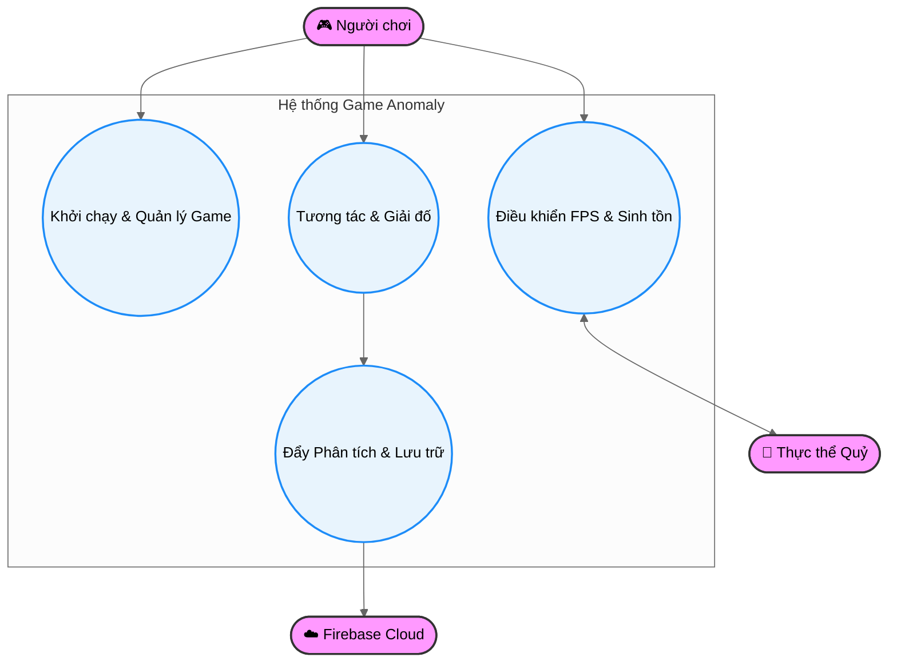

---

### 2.1.2. Sơ đồ Use Case Phân hệ Giải đố & Dị thường (Core & Anomaly Subsystem)

Mô tả sâu cơ chế cốt lõi: người chơi quan sát dị thường môi trường và đưa ra quyết định đi tiếp hay quay lui.

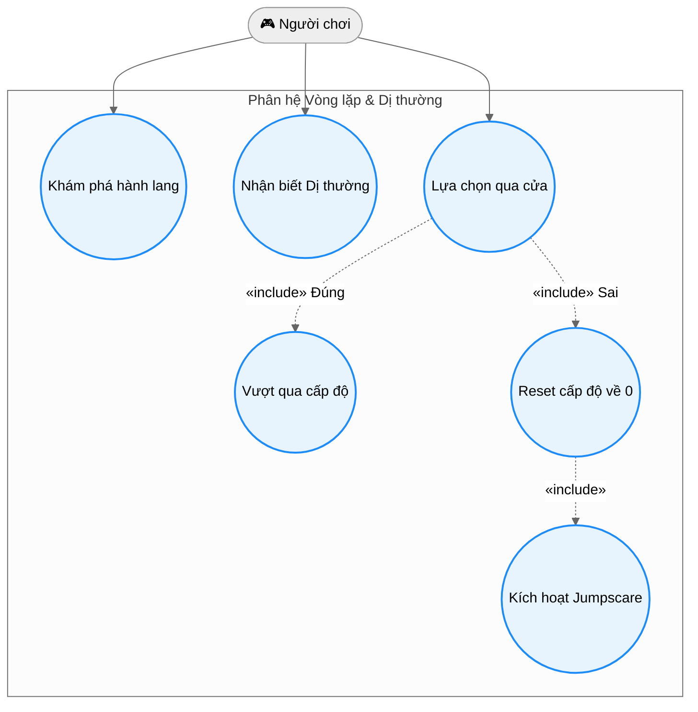

---

### 2.1.3. Sơ đồ Use Case Phân hệ Tương tác & Túi đồ (Interaction & Inventory Subsystem)

Thể hiện chi tiết cách người chơi tương tác nhặt manh mối cốt truyện, đọc tài liệu và sử dụng trang bị đặc biệt để xua đuổi tà ác.

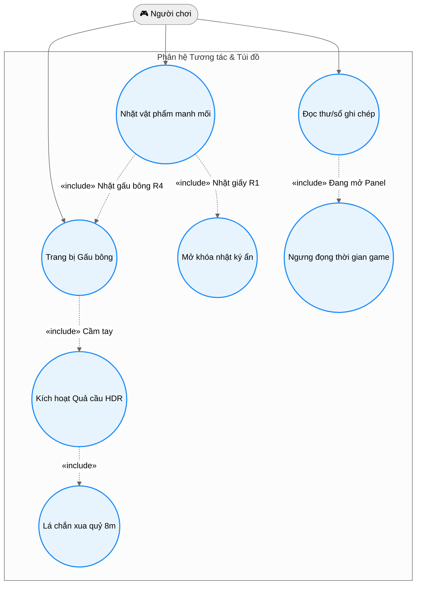

---

### 2.1.4. Sơ đồ Use Case Phân hệ AI Quái vật & Rượt đuổi (Monster AI & Chase Subsystem)

Chi tiết hóa hành vi sinh tồn của người chơi và các phản hồi tự động thông minh của quái vật (bao gồm cả các cơ chế bảo vệ mã nguồn tự sửa lỗi).

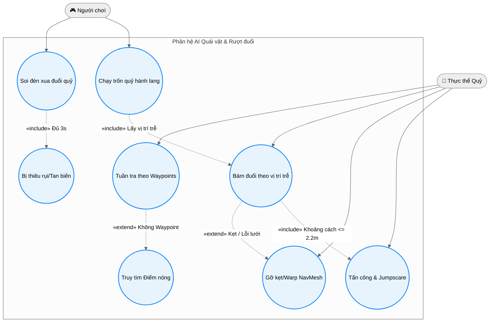

---

### 2.1.5. Sơ đồ Use Case Phân hệ Giao diện & Đồng bộ Dữ liệu (UI & Cloud Storage Subsystem)

Mô tả luồng tương tác cấu hình hệ thống, lưu trữ cục bộ và đồng bộ hóa đám mây Firebase.

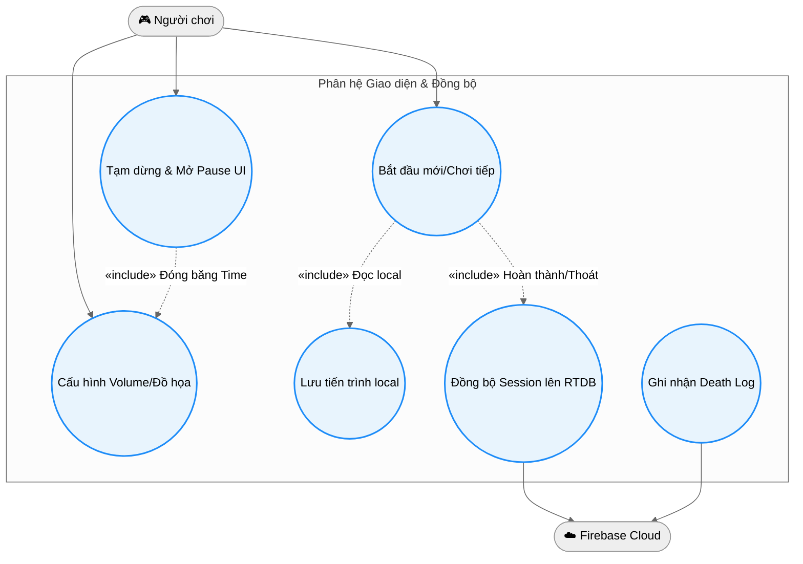

---

### 2.1.6. Bảng Đặc tả chi tiết các Use Case quan trọng

#### Use Case 1: Đưa ra Lựa chọn qua cửa (UC_Loop3)
* **Actor chính:** Người chơi.
* **Mô tả:** Người chơi tiến sát và bước qua một trong các cửa tại cuối hành lang (Đi tiếp / Quay lại).
* **Điều kiện tiền quyết (Precondition):** Cấp độ hiện tại chưa đạt tối đa (Level < 8), hành lang đã sinh dị thường hoặc bình thường xong.
* **Luồng sự kiện chính (Basic Flow):**
    1. Người chơi bước vào vùng va chạm (Collider Trigger) của cửa.
    2. Cửa gửi thông điệp `OnPlayerMakeChoice(isAnomalyDoor)` về `LevelManager`.
    3. `LevelManager` truy vấn trạng thái dị thường thực tế tại `AnomalyManager`.
    4. Nếu Lựa chọn ĐÚNG: Hệ thống tăng `currentLevel`, phát sự kiện cập nhật HUD, kích hoạt màn hình Fade tối màn hình và dịch chuyển Player tới phòng tiếp theo.
* **Luồng thay thế (Alternative Flow):**
    * Nếu Lựa chọn SAI: `LevelManager` reset `currentLevel` về 0, gửi lệnh kích hoạt jumpscare hù dọa ngẫu nhiên, sau đó dịch chuyển người chơi về điểm xuất phát hành lang gốc.

#### Use Case 2: Tấn công & Jumpscare Zoom Camera (UC_M8)
* **Actor chính:** Quỷ quái (Demon AI), Người chơi (Nạn nhân).
* **Mô tả:** Quỷ tiếp cận sát người chơi, khóa chuyển động của người chơi và thực hiện chuỗi Jumpscare zoom camera cận cảnh mặt quỷ trước khi kết thúc game.
* **Điều kiện tiền quyết:** Khoảng cách giữa quỷ và người chơi nhỏ hơn hoặc bằng 2.2 mét.
* **Luồng sự kiện chính (Basic Flow):**
    1. Quỷ vô hiệu hóa `NavMeshAgent` của bản thân để dừng di chuyển vật lý.
    2. Gọi `FirstPersonController.Instance.FreezePlayer()` để đóng băng hoàn toàn di chuyển và góc xoay chuột của người chơi.
    3. Phát hoạt ảnh `ATTACK` thông qua Animator.
    4. Tách camera chính khỏi nhân vật (`cam.transform.SetParent(null)`).
    5. Định vị xương đầu của quỷ bằng `FindHeadPosition()` (Ưu tiên xương tên "head", hoặc dùng bounding box mesh renderer).
    6. Tính toán vị trí camera tối ưu đứng cách mặt quỷ 1.2 - 2.0 mét.
    7. Thực hiện bắn tia Raycast an toàn từ mặt quỷ tới vị trí camera tối ưu để phát hiện tường chắn. Nếu chạm tường, tự động lùi camera lại một khoảng an toàn nhằm chống lỗi camera đi xuyên qua tường.
    8. Di chuyển và xoay camera mượt mà trong 0.4s hướng thẳng vào mặt quỷ.
    9. Chờ hoạt ảnh tấn công kết thúc (1.5s), phát màn hình GameOver đỏ máu và kích hoạt sự kiện kết thúc xấu.

---

## 2.2. Sơ đồ Lớp (Class Diagram)

Sơ đồ lớp thể hiện mối quan hệ (Kế thừa, Liên kết, Phụ thuộc) giữa các thành phần mã nguồn cốt lõi trong dự án. Để tối ưu hóa cho việc chèn vào báo cáo đồ án tốt nghiệp, phần này được chia thành hai phiên bản:

1. **Phiên bản Tối giản (Khuyên dùng chèn báo cáo)**: Sử dụng cấu hình tăng kích cỡ chữ hiển thị, lược bỏ các phương thức/thuộc tính phụ, và ẩn các đường kế thừa từ UnityEngine (`MonoBehaviour`, `ScriptableObject`) để tập trung hoàn toàn vào mối quan hệ nghiệp vụ, giúp sơ đồ cực kỳ gọn gàng và **đọc rõ chữ khi in trên khổ giấy A4**.
2. **Phiên bản Chi tiết Đầy đủ**: Phục vụ mục đích tra cứu chi tiết toàn bộ mã nguồn của hệ thống.

---

### 2.2.1. Phiên bản Tối giản (Tối ưu hóa Báo cáo - Chữ to, Gọn gàng)

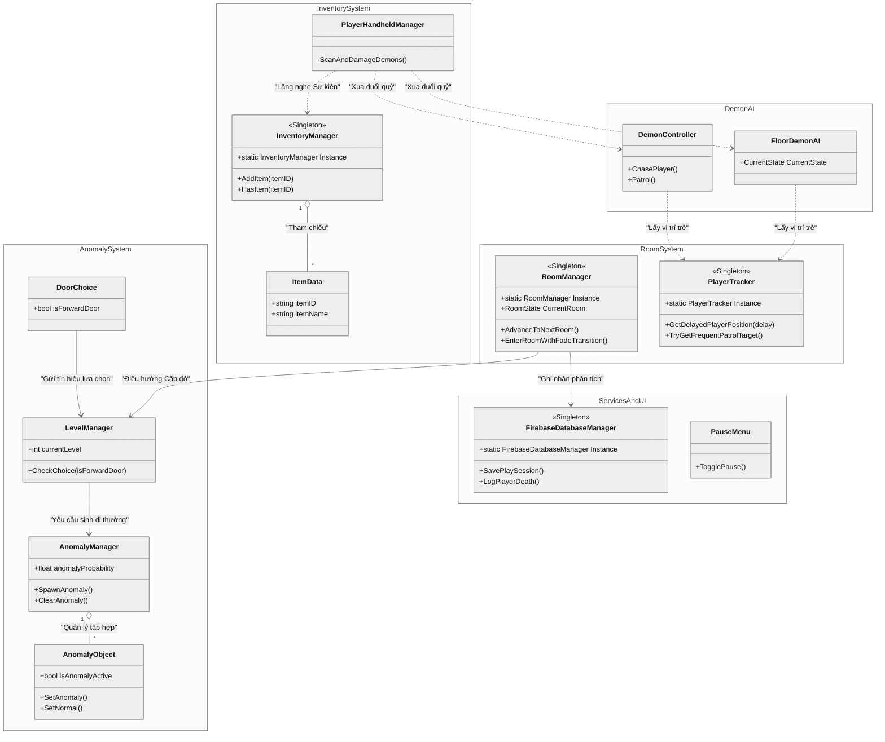

---

### 2.2.2. Phiên bản Chi tiết Đầy đủ (Phục vụ Đặc tả Kỹ thuật / Phụ lục)

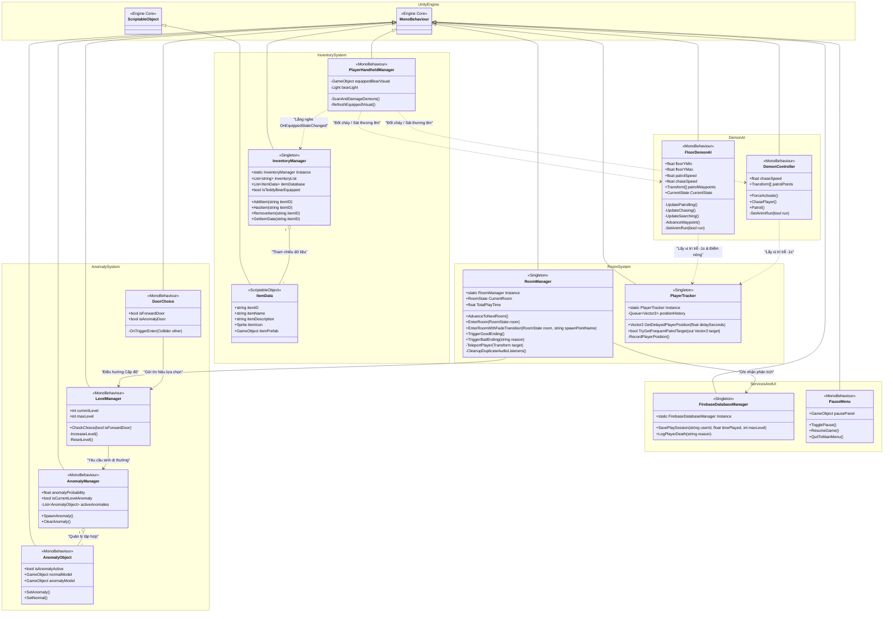

---

## 2.3. Sơ đồ Hoạt động Vòng lặp Gameplay (Activity Diagram - Core Loop)

Sơ đồ mô tả quy trình logic một vòng đời lặp lại của game: Từ lúc tải phòng chơi, tạo sinh dị thường, người chơi quan sát cho đến khi đưa ra quyết định đi tiếp hay lùi lại.

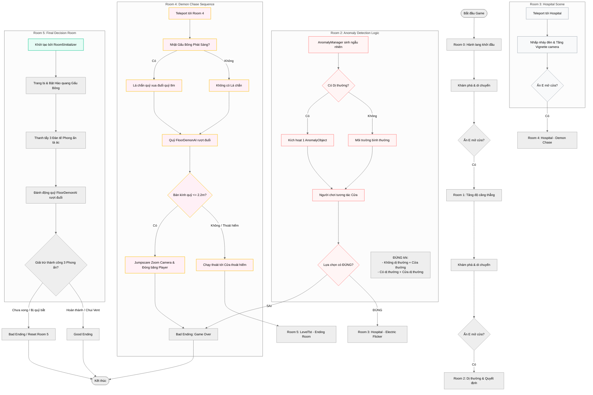

---

## 2.4. Sơ đồ Tuần tự Xử lý Lựa chọn (Sequence Diagram - Door Choice Validation)

Sơ đồ tuần tự thể hiện sự giao tiếp thời gian thực giữa Nhân vật, Cửa phát hiện va chạm, Quản lý cấp độ, Quản lý dị thường và Hệ thống giao diện khi người chơi đưa ra quyết định.

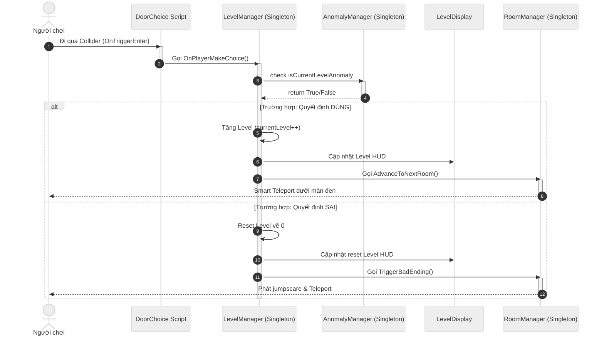

---

## 2.5. Sơ đồ Trạng thái AI Quái vật (State Diagram - Demon AI FSM)

Sơ đồ biểu diễn hành vi động của quái vật AI (`DemonController.cs`) đuổi bắt người chơi trong các phân đoạn kinh dị rượt đuổi.

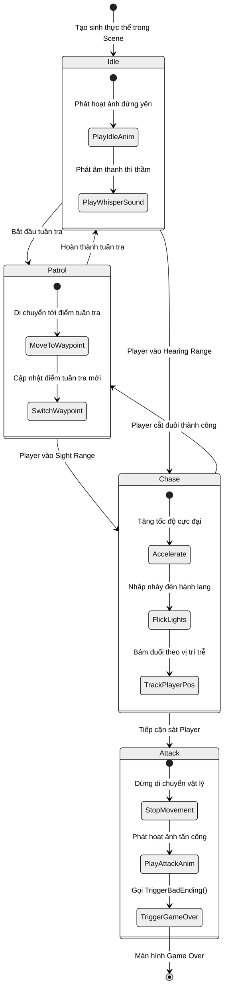

---

## 2.6. Sơ đồ Kiến trúc Thành phần Component (Component-Based Architecture Diagram)

Mô tả kiến trúc đặc trưng trong dự án Unity, thể hiện cách các GameObjects được lắp ghép từ các Components độc lập để thực hiện chức năng cụ thể mà không làm mã nguồn bị phụ thuộc chéo.

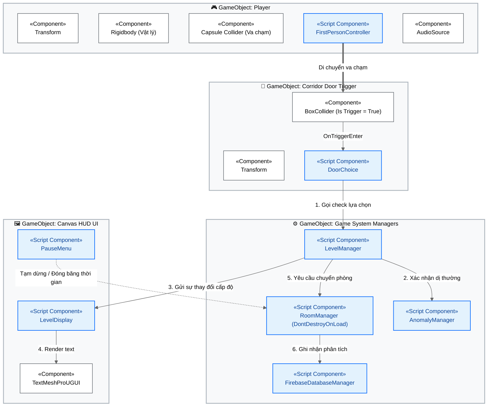

---

## 2.7. Sơ đồ Luồng Điều hướng Giao diện (UI Flow Diagram)

Sơ đồ điều hướng các màn hình tương tác trong game, bao gồm cả các trạng thái trung gian như thiết lập và kết thúc.

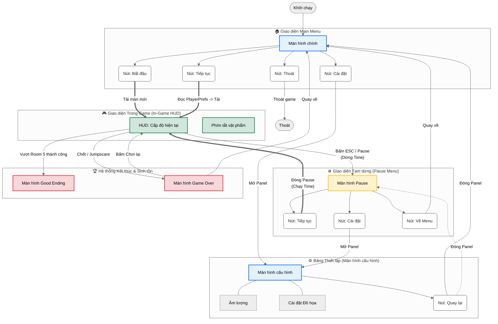

---

## 2.8. Sơ đồ Luồng Lưu trữ Dữ liệu Firebase (Firebase Integration Data Flow)

Sơ đồ mô tả quy trình luân chuyển dữ liệu từ các sự kiện trong game thông qua `FirebaseDatabaseManager` lên hệ thống Firebase Realtime Database.

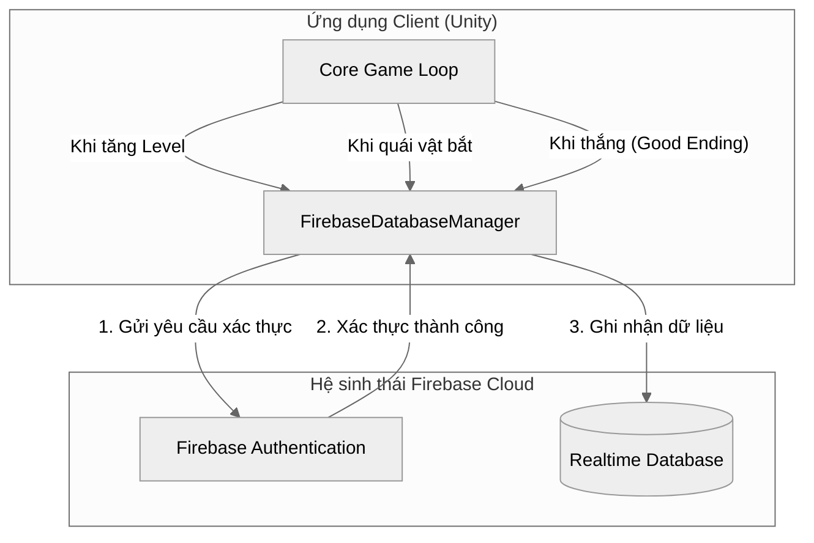

---

## KẾT LUẬN & ĐÁNH GIÁ KIẾN TRÚC HỆ THỐNG

Việc sử dụng các sơ đồ UML chi tiết trên đã giúp dự án **Game 3D giải đố tìm điểm bất thường** đạt được các tiêu chuẩn tối ưu trong phát triển phần mềm đồ họa tương tác:

1. **Tính độc lập của Component (Decoupling):** Các Script như `PlayerTracker`, `InventoryManager`, `AudioManager` hoạt động dưới dạng các Singleton độc lập, giao tiếp với nhau bằng các hệ thống lắng nghe sự kiện giúp giảm thiểu sự phụ thuộc chéo.
2. **Khả năng tự hồi phục (Self-Healing & Robustness):** Các giải pháp tự động sửa kẹt NavMesh (`NavMesh Bridge Warp`), tìm kiếm mặt quỷ thông minh (`Non-Humanoid Head Locator`), ngăn chặn camera xuyên tường (`SafeTargetPos`) đảm bảo trò chơi vận hành trơn tru ngay cả khi tài nguyên 3D không hoàn hảo.
3. **Đồng bộ hóa đám mây tối ưu:** Kiến trúc gửi dữ liệu không đồng bộ của Firebase đảm bảo trải nghiệm chơi không bị gián đoạn (lag/giật hình) khi ghi nhận logs.
