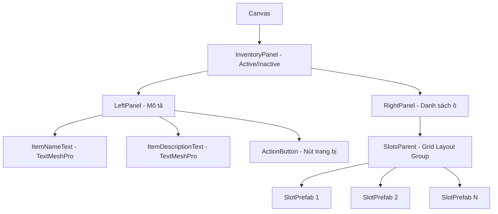

# Hướng Dẫn Thiết Lập Hệ Thống Túi Đồ (Inventory System Setup Guide)

Dự án của bạn đã được lập trình sẵn một hệ thống túi đồ cực kỳ hoàn chỉnh, chuyên nghiệp và có tính năng tự phục hồi dữ liệu vượt trội (**self-healing item database**), hỗ trợ cả vật phẩm 2D (Icon) lẫn hiển thị mô hình 3D xoay trong ô (Prefab). 

Dưới đây là tài liệu hướng dẫn chi tiết cách thiết lập, cấu hình và sử dụng hệ thống này trực tiếp trong Unity Editor.

---

## I. Tổng Quan Các Thành Phần Đã Lập Trình

Hệ thống túi đồ được quản lý bởi các tệp mã nguồn sau:
1. **[ItemData.cs](file:///d:/%C4%90%E1%BB%93%20%C3%A1n%20t%E1%BB%91t%20nghi%E1%BB%87p/3D/Assets/Scripts/AnomalySystem/ItemData.cs):** Định nghĩa cấu trúc vật phẩm dưới dạng `ScriptableObject`. Mỗi vật phẩm có ID, Tên, Mô tả, Sprite Icon 2D hoặc mô hình Prefab 3D.
2. **[InventoryManager.cs](file:///d:/%C4%90%E1%BB%93%20%C3%A1n%20t%E1%BB%91t%20nghi%E1%BB%87p/3D/Assets/Scripts/AnomalySystem/InventoryManager.cs):** Bộ quản lý trung tâm (Singleton). Tự động lưu/tải dữ liệu qua `PlayerPrefs` (`SavedInventory`), quản lý danh sách vật phẩm, trạng thái trang bị Gấu Bông Phát Sáng (`TeddyBear`) và tự tạo dữ liệu mặc định tại runtime nếu bạn quên thiết lập trong Editor.
3. **[InventoryUI.cs](file:///d:/%C4%90%E1%BB%93%20%C3%A1n%20t%E1%BB%91t%20nghi%E1%BB%87p/3D/Assets/Scripts/UI/InventoryUI.cs):** Quản lý giao diện túi đồ, hiển thị thông tin chi tiết vật phẩm khi nhấp chọn, tự động sinh nút **Trang bị / Tháo trang bị** cực kỳ sang trọng ở bảng mô tả khi người chơi chọn Gấu Bông.
4. **[InventorySlot.cs](file:///d:/%C4%90%E1%BB%93%20%C3%A1n%20t%E1%BB%91t%20nghi%E1%BB%87p/3D/Assets/Scripts/UI/InventorySlot.cs):** Quản lý từng ô đồ riêng biệt. Tự động lắng nghe các sự kiện rê chuột (hover), nhấn chuột (click) và vẽ Icon 2D hoặc mô hình 3D Prefab tương ứng vào ô đồ.

---

## II. Hướng Dẫn Thiết Lập Từng Bước Trong Unity

### Bước 1: Tạo Cơ Sở Dữ Liệu Vật Phẩm (Item Database)
Bạn cần tạo các tệp dữ liệu lưu thông tin tên, mô tả của các vật phẩm trong game.
1. Trong cửa sổ **Project**, tạo thư mục `Assets/Resources/Items` (hoặc bất cứ thư mục nào bạn muốn).
2. Nhấp chuột phải chọn **Create ➔ Inventory ➔ Item Data**.
3. Đặt tên tệp vừa tạo tương ứng với vật phẩm (ví dụ: `Item_TeddyBear`).
4. Tại cửa sổ **Inspector**, nhập các thông tin:
   - **Item ID:** Phải nhập **chính xác** từ khóa của vật phẩm trong code để hệ thống nhận diện (ví dụ: `Book`, `TornPage_Room1`, `BibleNote_Room3`, `MannequinNote_Room4`, `TeddyBear`).
   - **Item Name:** Tên hiển thị (ví dụ: *Gấu Bông Phát Sáng*).
   - **Item Description:** Mô tả chi tiết (ví dụ: *Con gấu bông kỳ bí tỏa ra ánh sáng ấm áp...*).
   - **Item Icon:** Kéo thả ảnh Sprite 2D đại diện vào đây.
   - **Item Prefab:** (Tùy chọn) Kéo thả mô hình 3D nếu bạn muốn ô đồ hiển thị dạng 3D xoay.

> [!NOTE]
> Hệ thống có cơ chế tự phục hồi: Nếu bạn chưa kịp tạo các file ItemData này, `InventoryManager` vẫn sẽ tự động nhận diện và sinh tên/mô tả tiếng Việt mặc định tại runtime khi người chơi nhặt đồ, đảm bảo game không bị lỗi crash!

---

### Bước 2: Thiết Lập Quản Lý Trung Tâm (Inventory Manager)
1. Tạo một GameObject trống trong scene khởi đầu (thường là Scene `MainMenu` hoặc trong GameManager của `LevelTst`). Đặt tên là `InventoryManager`.
2. Gán script `InventoryManager` vào GameObject này.
3. Tại trường **Item Database** trên Inspector, bạn kéo thả tất cả các tệp `ItemData` (ScriptableObject) đã tạo ở **Bước 1** vào danh sách này.

---

### Bước 3: Thiết Lập Giao Diện Túi Đồ (Inventory UI Canvas)
Bạn có thể tự thiết kế hoặc sử dụng UI có sẵn, thiết lập cấu trúc phân cấp như sau:



1. **Cấu hình InventoryUI Component:**
   - Gán script `InventoryUI` vào GameObject `InventoryPanel`.
   - Kéo thả đối tượng `ItemNameText` (TextMeshProUGUI) vào trường **Item Name Text**.
   - Kéo thả đối tượng `ItemDescriptionText` (TextMeshProUGUI) vào trường **Item Description Text**.
   - Kéo thả đối tượng `SlotsParent` (nơi chứa các ô đồ) vào trường **Slots Parent**.

2. **Cấu hình Ô Túi Đồ (SlotPrefab):**
   - Mỗi ô vật phẩm con nằm dưới `SlotsParent` cần được gán script `InventorySlot`.
   - Cấu trúc con bên trong mỗi ô vật phẩm:
     - Tạo một GameObject con đặt tên là `IconImage` (gán component `Image`) để hiển thị ảnh 2D.
     - Tạo một GameObject con đặt tên là `HighlightAsset` (hình viền sáng khi được click chọn). Mặc định ẩn.
     - Tạo một GameObject con đặt tên là `HoverAsset` (hình viền sáng nhẹ khi rê chuột qua). Mặc định ẩn.
   - Script `InventorySlot` sẽ **tự động tìm kiếm và liên kết** các thành phần `IconImage`, `HighlightAsset`, `HoverAsset` tại runtime nếu bạn không kéo thả thủ công, đảm bảo thiết lập cực kỳ nhàn hạ!

---

## III. Hướng Dẫn Sử Dụng Code (Developer API)

### 1. Cách Nhặt Vật Phẩm Từ Script Khác
Khi người chơi tương tác với một cuốn sách, mảnh giấy hay gấu bông trên sàn nhà, bạn chỉ cần gọi dòng code sau để nhét đồ vào túi của họ:

```csharp
using AnomalySystem;

// Thêm Gấu Bông vào túi đồ của người chơi
InventoryManager.Instance.AddItem("TeddyBear");

// Thêm Mảnh giấy Room 1 vào túi
InventoryManager.Instance.AddItem("TornPage_Room1");
```

### 2. Cách Kiểm Tra Người Chơi Đã Có Vật Phẩm Chưa (Dùng khi Giải Đố / Mở Cửa)
Nếu bạn muốn tạo một cánh cửa chỉ mở khi người chơi đã nhặt được chìa khóa hoặc mảnh giấy:

```csharp
using AnomalySystem;

if (InventoryManager.Instance.HasItem("BibleNote_Room3"))
{
    Debug.Log("Người chơi đã có Trang Kinh Thánh! Cho phép mở cửa.");
    // Thực hiện logic mở cửa tại đây
}
else
{
    Debug.Log("Bạn chưa tìm thấy Trang Kinh Thánh!");
}
```

### 3. Cách Mở / Đóng Giao Diện Túi Đồ Bằng Phím Tắt
Bạn có thể gắn đoạn code mẫu sau vào script `FirstPersonController.cs` hoặc một GameManager để người chơi đóng/mở túi đồ bằng phím **Tab** hoặc phím **I**:

```csharp
using UnityEngine;
using GameUI;

public class InventoryToggle : MonoBehaviour
{
    public GameObject inventoryPanel; // Kéo thả InventoryPanel vào đây
    private bool isOpen = false;

    void Update()
    {
        if (Input.GetKeyDown(KeyCode.Tab) || Input.GetKeyDown(KeyCode.I))
        {
            isOpen = !isOpen;
            inventoryPanel.SetActive(isOpen);

            // Mở khóa chuột khi xem túi đồ
            Cursor.lockState = isOpen ? CursorLockMode.None : CursorLockMode.Locked;
            Cursor.visible = isOpen;

            // Dừng camera di chuyển của FirstPersonController nếu cần
            var controller = FindObjectOfType<FirstPersonController>();
            if (controller != null)
            {
                controller.enabled = !isOpen;
            }
        }
    }
}
```

---

## IV. Kiểm Tra & Nghiệm Thu
1. Tạo một vật phẩm giả lập trong Game bằng cách chạy thử scene, mở cửa sổ **Console**.
2. Nhấn một phím bất kỳ (hoặc kích hoạt sự kiện nhặt đồ) để chạy lệnh `InventoryManager.Instance.AddItem("TeddyBear")`.
3. Mở bảng túi đồ lên, bạn sẽ thấy ô đồ đầu tiên chuyển sang màu sáng, vẽ hình Gấu bông.
4. Click chuột vào ô Gấu bông: Bảng thông tin mô tả chi tiết tiếng Việt hiện ra bên trái cùng nút **Trang bị** màu đỏ horror-glassmorphism.
5. Click **Trang bị**: Nút sẽ tự động chuyển trạng thái thành **Tháo trang bị** và kích hoạt cơ chế bảo vệ của Gấu bông!
