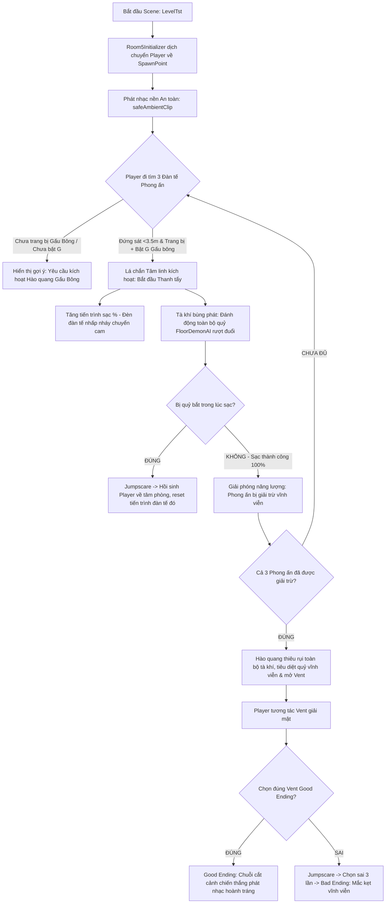

# Hướng dẫn Thiết kế & Cài đặt — Room 5 (Màn chơi Cuối - Nâng cao)

> **Cập nhật:** 02/06/2026  
> **Trạng thái:** Hoàn thành Codebase & Sẵn sàng Cấu hình Câu đố Phong ấn Lá chắn Gấu Bông trong Unity  

---

## 📌 Tổng quan về Room 5 (Ancient Seal Purge Room)

Để nâng cao độ thử thách và biến Room 5 trở thành một màn kết ấn tượng cho đồ án tốt nghiệp, màn chơi đã được nâng cấp lên **cơ chế giải đố "Đàn tế Phong ấn Lá chắn Gấu Bông"**. 

Người chơi không thể chỉ đơn thuần chạy đi tìm Vent thoát hiểm như trước. Thay vào đó, toàn bộ các cửa thoát hiểm (Vents) đều bị phong ấn bởi tà khí cổ đại. Để thoát thân, người chơi phải đi tìm và **thanh tẩy 3 Đàn tế Phong ấn tà ác** nằm rải rác trên bản đồ nhỏ 2 tầng bằng cách sử dụng **Lá chắn Tâm linh (Warding Shield)** của Gấu bông phát sáng.

### 🎮 Sơ đồ Luồng hoạt động & Logic câu đố mới:

---

## 🛠️ Hướng dẫn Cài đặt Từng Bước Trong Unity

### 1️⃣ Bước 1: Thiết lập Scene & Spawn Point
1. Mở cảnh chơi **`LevelTst`** (Room 5).
2. Tạo một **Empty GameObject** đặt tên là `Room5SpawnPoint` làm vị trí xuất hiện của người chơi.
3. Tạo một **Empty GameObject** khác đặt tên là `Room5Initializer`, gắn component **`Room5Initializer`** và kéo gán `Room5SpawnPoint` vào ô `Player Spawn Point`.

---

### 2️⃣ Bước 2: Thiết lập Bộ Điều phối Âm thanh Động (`Room5AudioDirector`)
1. Tạo một **Empty GameObject** đặt tên là **`Room5AudioDirector`**.
2. Nhấn **Add Component** → chọn **`Room5AudioDirector`**.
3. Gán các tài nguyên âm thanh tương ứng:
   - **Safe Ambient Clip:** Nhạc dạo u ám nhẹ nhàng (ví dụ tải từ YouTube: `xv2RiLGbXo0`).
   - **Danger Chase Clip:** Nhạc rượt đuổi dồn dập (ví dụ lấy từ gói *Backrooms Entity SFX Vol 2* trên Asset Store).
   - **Player Breathing Clip:** Tiếng thở dốc sợ hãi của nhân vật.
   - **Danger Distance Threshold:** Đặt bằng `10` (mét).
   - **Crossfade Speed:** Đặt bằng `1.5`.

---

### 3️⃣ Bước 3: Cấu hình AI Quỷ 2 Tầng (`FloorDemonAI`)
1. Tạo 2 GameObject trống `NavMesh_Floor1` và `NavMesh_Floor2` gắn component **`NavMesh Surface`** để nướng lưới di chuyển độc lập cho **Tầng 1 (Y: 0m -> 4.5m)** và **Tầng 2 (Y: 4.5m -> 10m)**.
2. Đặt `Demon_Floor1` ở Tầng 1, cấu hình component **`FloorDemonAI`**:
   - `Floor Y Min = 0` | `Floor Y Max = 4.5`.
   - Gán lộ trình tuần tra `Patrol Waypoints` nằm hoàn toàn ở **Tầng 1**.
3. Đặt `Demon_Floor2` ở Tầng 2, cấu hình component **`FloorDemonAI`**:
   - `Floor Y Min = 4.5` | `Floor Y Max = 10.0`.
   - `Start Delay = 3.0` *(Trì hoãn kích hoạt để tránh trùng lặp âm gầm rú)*.
   - Gán lộ trình tuần tra `Patrol Waypoints` nằm hoàn toàn ở **Tầng 2**.

---

### 4️⃣ Bước 4: Thiết lập 3 Đàn tế Phong ấn Cổ Đại (`Room5SealPurge`)
Đây là cốt lõi của câu đố mới. Chúng ta sẽ đặt 3 đàn tế tại các vị trí khuất khác nhau ở cả 2 tầng của map.

1. Tạo một **GameObject 3D** (ví dụ: một cái đài đá, đài tế cổ hoặc một khối hộp trang trí phát sáng) và đặt tại góc bản đồ. Đặt tên là `AncientSeal_1`.
2. Nhấn **Add Component** → chọn **`Room5SealPurge`**.
3. **Cơ chế âm thanh thông minh & tự động hóa đã được tích hợp sẵn:**
   - 🛡️ **Hệ thống tự sửa lỗi (Self-Healing AudioSource):** Bạn **không cần phải tự tay add component `AudioSource`**. Nếu để trống ô `Audio Source` trên Script, khi nhấn Play, hệ thống sẽ tự động thêm và cấu hình `AudioSource` 3D lập thể đầy đủ (`spatialBlend = 1f`, logarithmic rolloff từ 2m đến 15m) tại đúng vị trí cột đàn tế.
   - 🎛️ **Tùy chỉnh âm lượng tùy ý (`Volume Scale`):** Trên Inspector của script `Room5SealPurge` có sẵn một thanh trượt **`Volume Scale`** từ `0` đến `1` (mặc định là `0.8`). Bạn có thể tùy ý điều chỉnh âm lượng riêng biệt cho từng đàn tế trực tiếp trong editor. Âm lượng này sẽ tự động nhân với âm lượng hiệu ứng chung (`SFX Volume`) trong bảng cài đặt Settings của người chơi để luôn đảm bảo tính đồng nhất.
   - 🔇 **Tự động giảm nhạc nền (BGM Ducking):** Khi bất kỳ nghi thức thanh tẩy nào đang diễn ra, bộ điều phối âm thanh **`Room5AudioDirector`** sẽ tự động phát hiện và thực hiện giảm sâu nhạc nền (`Safe Ambient BGM`) xuống còn **5%** một cách mượt mà (Crossfade). Khi nghi thức bị gián đoạn hoặc hoàn thành, nhạc nền sẽ tự động fade-up quay trở lại bình thường.
4. **Cấu hình các trường thông số khác trong Inspector:**
   - **Purge Duration:** `12` *(Cần 12 giây sạc liên tục để thanh tẩy)*.
   - **Active Distance:** `3.5` *(Bán kính đứng gần để sạc)*.
   - **Seal Light:** Tạo một `Point Light` nhỏ màu đỏ bên trong đàn tế và kéo gán vào đây để làm hiệu ứng phát sáng tà ác ban đầu.
   - **Purging Sound:** Gán một file âm thanh tà khí, tiếng kêu rú nhỏ phát loop liên tục lúc sạc.
   - **Cleared Sound:** Gán âm thanh nổ vang báo hiệu sạc thành công.
5. Nhân bản (Duplicate) thành `AncientSeal_2` and `AncientSeal_3` đặt tại các ngóc ngách khác trên Tầng 1 và Tầng 2 để ép người chơi phải thám hiểm và di chuyển liên tục.

---

### 5️⃣ Bước 5: Cấu hình cửa Vent thoát hiểm (`Room5ExitDoor`)
1. Đặt các Vent thoát hiểm vào các vị trí khuất. Gán component **`Room5ExitDoor`**.
2. Chỉ tích chọn **`Is Good Ending` = true** cho **duy nhất một Vent** chính xác. Các Vent còn lại bỏ tích chọn.
3. Khi người chơi đến gần Vent, nếu chưa giải trừ đủ 3 phong ấn, GUI sẽ tự động hiển thị dòng chữ đỏ cảnh báo: **"Lối thoát hiểm đang bị phong ấn bởi tà khí! (Số phong ấn đã giải/3)"** và khóa chặt cửa.

---

## 📋 Checklist Kiểm tra & Thử nghiệm (Testing Guide)

- [ ] Chạy trực tiếp scene **`LevelTst`** trong Unity Editor.
- [ ] Đi lại gần cửa Vent: Đảm bảo xuất hiện dòng chữ cảnh báo màu đỏ và cửa bị khóa chặt không cho phép chui qua.
- [ ] Di chuyển đi tìm các đàn tế phong ấn:
  - Nếu chưa trang bị Gấu bông (hoặc chưa nhấn phím **G** bật hào quang): Đứng gần đàn tế xuất hiện dòng chữ đỏ nhắc nhở: **"CẦN TRANG BỊ VÀ BẬT HÀO QUANG GẤU BÔNG [G]..."**.
  - Nhấn Tab trang bị Gấu bông, bấm **G** bật hào quang và đứng gần: Dòng chữ chuyển vàng **"ĐANG THANH TẨY PHONG ẤN: [X]%... (Đang thu hút quỷ dữ!)"**, đèn đàn tế bắt đầu nhấp nháy đỏ-cam bùng cháy dữ dội.
- [ ] Trong lúc sạc phong ấn: Đảm bảo nghe thấy tiếng gầm rú và con quỷ tuần tra ở tầng đó **ngay lập tức bị đánh động**, lao thẳng tới vị trí đàn tế để truy lùng bạn!
- [ ] Dùng hào quang của gấu bông chiếu thẳng vào mặt quỷ để làm nó chững lại (Flinch), khéo léo giữ vị trí trong bán kính sạc cho đến khi đạt 100%.
- [ ] Sạc thành công cả 3 phong ấn: Tiếng nổ thanh tẩy vang lên, toàn bộ quỷ dữ trong phòng tan biến vĩnh viễn, tà khí bị thiêu rụi hoàn toàn.
- [ ] Chạy đến Vent thoát hiểm: Dòng chữ chuyển xanh lá an toàn, cho phép tương tác nhấn **E** để thoát khỏi căn phòng ác mộng và tận hưởng **Good Ending** hoành tráng!

---
*Cơ chế này mang lại chiều sâu cực kỳ lớn cho đồ án tốt nghiệp của bạn, biến Gấu bông phát sáng từ một công cụ chiếu sáng thuần túy trở thành chìa khóa chiến thuật sống còn của màn chơi cuối!*
