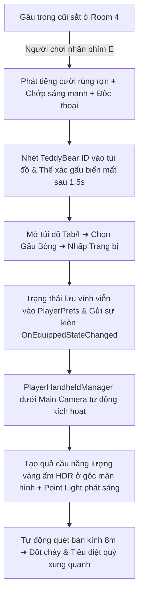

# Hướng Dẫn Thiết Lập Con Gấu Phát Sáng & Lá Chắn Bảo Vệ (Glowing Teddy Bear Setup Guide)

Hệ thống **Gấu Bông Phát Sáng (`TeddyBear`)** trong dự án của bạn là một tính năng cực kỳ độc đáo và mang tính chiến thuật cao cho dòng game kinh dị sinh tồn. Nó không chỉ là nguồn sáng xua tan bóng tối mà còn hoạt động như một **Lá chắn Tâm linh (Warding Shield)** tự động thiêu rụi và xua đuổi các thế lực tà ác xung quanh người chơi.

Tài liệu này hướng dẫn chi tiết cách thiết lập, cấu hình và sử dụng hệ thống này trực tiếp trong Unity Editor.

---

## I. Sơ Đồ Quy Trình Hoạt Động (Gameplay Flow)

Tính năng Gấu Bông Phát Sáng hoạt động tuần tự qua các giai đoạn sau:



---

## II. Các Tệp Tin Mã Nguồn Tham Gia

Logic Gấu Bông được điều khiển bởi 4 lớp chính:
1. **[TeddyBearGlow.cs](file:///d:/%C4%90%E1%BB%93%20%C3%A1n%20t%E1%BB%91t%20nghi%E1%BB%87p/3D/Assets/Scripts/Room4/TeddyBearGlow.cs):** Quản lý thực thể gấu đặt trong cũi sắt ở Room 4. Điều khiển hiệu ứng nhấp nháy, lắng nghe tương tác nhặt đồ bằng phím **E**, phát âm thanh tiếng cười và tự ẩn đi sau khi nhặt.
2. **[InventoryManager.cs](file:///d:/%C4%90%E1%BB%93%20%C3%A1n%20t%E1%BB%91t%20nghi%E1%BB%87p/3D/Assets/Scripts/AnomalySystem/InventoryManager.cs):** Lưu giữ trạng thái trang bị Gấu Bông (`IsTeddyBearEquipped`) xuống ổ cứng bằng PlayerPrefs và phát ra sự kiện toàn cục `OnEquippedStateChanged` khi người chơi bấm nút trang bị.
3. **[InventoryUI.cs](file:///d:/%C4%90%E1%BB%93%20%C3%A1n%20t%E1%BB%91t%20nghi%E1%BB%87p/3D/Assets/Scripts/UI/InventoryUI.cs):** Nhận diện ID `"TeddyBear"` trong túi đồ để hiển thị thông tin chi tiết và tự sinh nút **Trang bị / Tháo trang bị** màu đỏ.
4. **[PlayerHandheldManager.cs](file:///d:/%C4%90%E1%BB%93%20%C3%A1n%20t%E1%BB%91t%20nghi%E1%BB%87p/3D/Assets/Scripts/Gameplay/PlayerHandheldManager.cs):** Gắn trực tiếp dưới Camera nhân vật. Khi gấu được trang bị, script tự sinh quả cầu năng lượng phát sáng HDR màu vàng ấm ở góc màn hình và liên tục dò quét tiêu diệt quỷ trong bán kính 8 mét.

---

## III. Hướng Dẫn Thiết Lập Trong Unity Editor

### Bước 1: Cấu hình Thực Thể Gấu ở Room 4 (Scene Hospital)
1. Mở Scene **`Hospital`** (hoặc scene chứa Room 4 của bạn).
2. Tìm đến con gấu bông được đặt trong cái cũi sắt ở góc phòng Room 4.
3. Kéo thả script **`TeddyBearGlow.cs`** gán vào con gấu bông này.
4. Cấu hình các trường thông tin trên Inspector của con gấu bông:
   - **Laugh Sound:** Kéo thả tệp âm thanh tiếng cười kinh dị `.mp3` hoặc `.wav` vào đây.
   - **Interact Monologue:** Kéo thả tệp Độc thoại nội tâm của bạn vào đây (ví dụ dòng chữ độc thoại *"Con gấu bông này... hình như nó đang phát ra nhịp thở?"*).
   - **Bear Item ID:** Nhập chính xác là **`TeddyBear`**.

---

### Bước 2: Thiết Lập Lá Chắn Cầm Tay Cho Nhân Vật (Player)
Bạn hoàn toàn không cần phải thiết kế mô hình 3D cầm tay hay thiết lập nguồn sáng thủ công cho nhân vật, hệ thống sẽ tự động vẽ đồ họa HDR và Point Light tại runtime cực kỳ chuyên nghiệp!

1. Mở Scene chơi chính của bạn (ví dụ: scene **`LevelTst`** hoặc scene gameplay bất kỳ có chứa nhân vật Player).
2. Trong Hierarchy, tìm đến đối tượng **`Main Camera`** (Camera chính nằm ngay phía dưới GameObject Player của bạn).
3. Kéo thả script **`PlayerHandheldManager.cs`** gán vào đối tượng **`Main Camera`** này.

---

## IV. Giải Thích Logic Lá Chắn Đốt Quỷ (Warding Shield)

Khi Gấu Bông được trang bị, mỗi khung hình script `PlayerHandheldManager` sẽ tự động thực hiện các tác vụ sau:

### 1. Hiệu ứng đồ họa góc nhìn thứ nhất (Glow Visuals)
* Sinh ra một quả cầu năng lượng vàng ấm phát sáng cực mạnh (sử dụng màu phát xạ Emission HDR nhân 2.5 lần cường độ) tại tọa độ `(0.35f, -0.28f, 0.48f)` tương đối dưới Camera, đặt nó nằm gọn gàng ở góc dưới bên phải màn hình.
* Tạo ra một Point Light phát sáng dịu nhấp nháy nhịp nhàng giả lập nhịp thở của linh hồn bảo vệ với bán kính phát sáng rộng **8 mét**.

### 2. Tự động thiêu rụi Quỷ dữ
* Sử dụng phương thức quét vật lý `Physics.OverlapSphere(transform.position, 8f)` để liên tục quét tất cả các Collider trong bán kính 8 mét xung quanh người chơi.
* Nếu phát hiện quỷ hành lang (`DemonController`) hoặc quỷ tầng chuyên dụng (`FloorDemonAI`), script tự động gọi hàm gây sát thương liên tục:
  ```csharp
  demon.OnLightHit(Time.deltaTime * 0.8f);
  ```
* Quỷ khi bước vào vùng sáng này sẽ bị khựng lại (chơi hoạt ảnh flinch đau đớn) và bị **thiêu rụi, tan biến hoàn toàn** sau 3 giây tiếp xúc liên tục mà không thể tiếp cận để làm hại người chơi!

---

## V. Hướng Dẫn Nghiệm Thu (Testing)
1. Nhấn nút **Play** ở scene chơi chính.
2. Gọi lệnh nhặt gấu (hoặc mở túi đồ lên, hệ thống tự động sinh dữ liệu mặc định của Gấu Bông).
3. Nhấp chọn Gấu bông ➔ Bấm **Trang bị**.
4. Góc dưới phải màn hình sẽ xuất hiện **Quả cầu năng lượng vàng phát sáng HDR** tuyệt đẹp cùng nguồn sáng bao quanh bạn.
5. Dẫn dụ con quỷ lại gần ➔ Khi nó chạm vào vùng sáng vàng cách bạn 8 mét, nó sẽ lập tức bị giật mình đau đớn, giãy giụa và tan biến ngay trước mắt bạn!
