# Biểu đồ UML Thiết kế Game 3D Anomaly

Tài liệu này bao gồm các sơ đồ UML chuyên biệt để mô tả kiến trúc và luồng hoạt động của game 3D Anomaly, được thiết kế bám sát vào cấu trúc mã nguồn thực tế của dự án (`AnomalySystem`, `Mobile Input`, `FirstPersonController`, `UI`). 

Bạn có thể copy mã code bên dưới để hiển thị trên các công cụ hỗ trợ Mermaid (như GitHub, Obsidian, Notion) hoặc paste trực tiếp vào các trình vẽ sơ đồ.

---

## 1. Sơ đồ Use-case (Use-case Diagram)
Mô tả các tính năng chính mà người chơi (Player) có thể tương tác với hệ thống game.

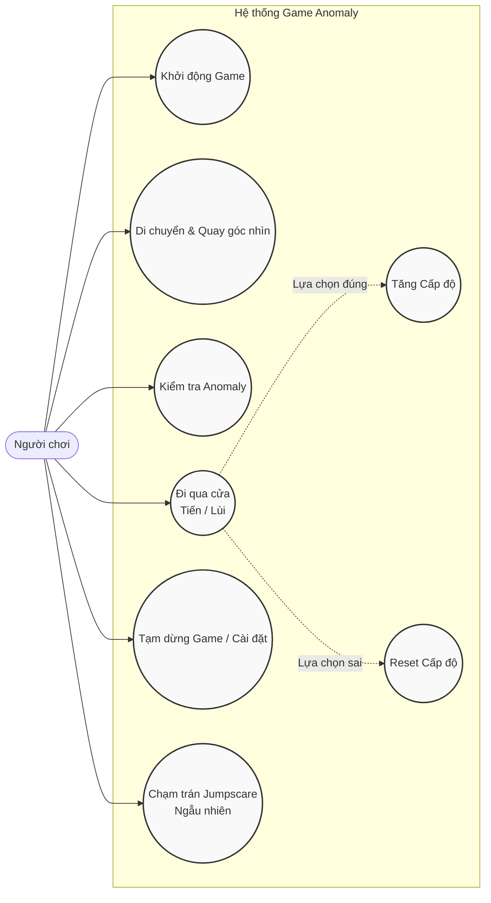

---

## 2. Sơ đồ Tuần tự (Sequence Diagram)
Mô tả luồng tương tác chi tiết khi người chơi đưa ra quyết định đi qua một cánh cửa (Đi tiếp hoặc Quay lại) tại hành lang.

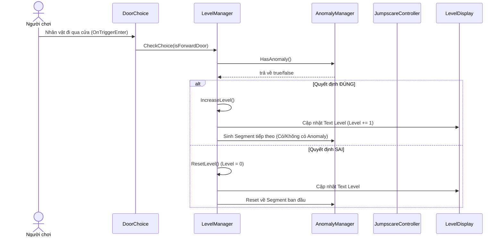

---

## 3. Sơ đồ Hoạt động (Activity Diagram)
Mô tả quy trình logic cốt lõi (Core Game Loop) của hệ thống level.

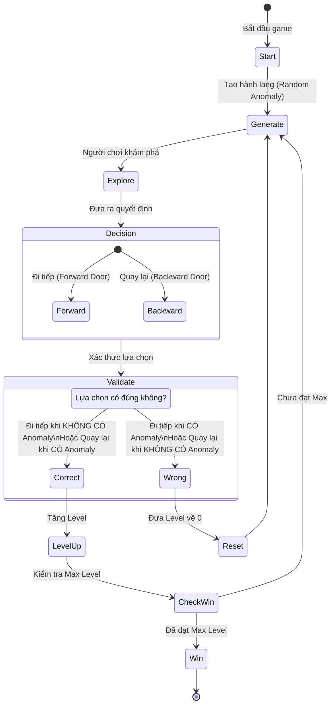

---

## 4. Sơ đồ Lớp (Class Diagram)
Mô tả các thành phần class chính yếu trong dự án và mối quan hệ giữa chúng.

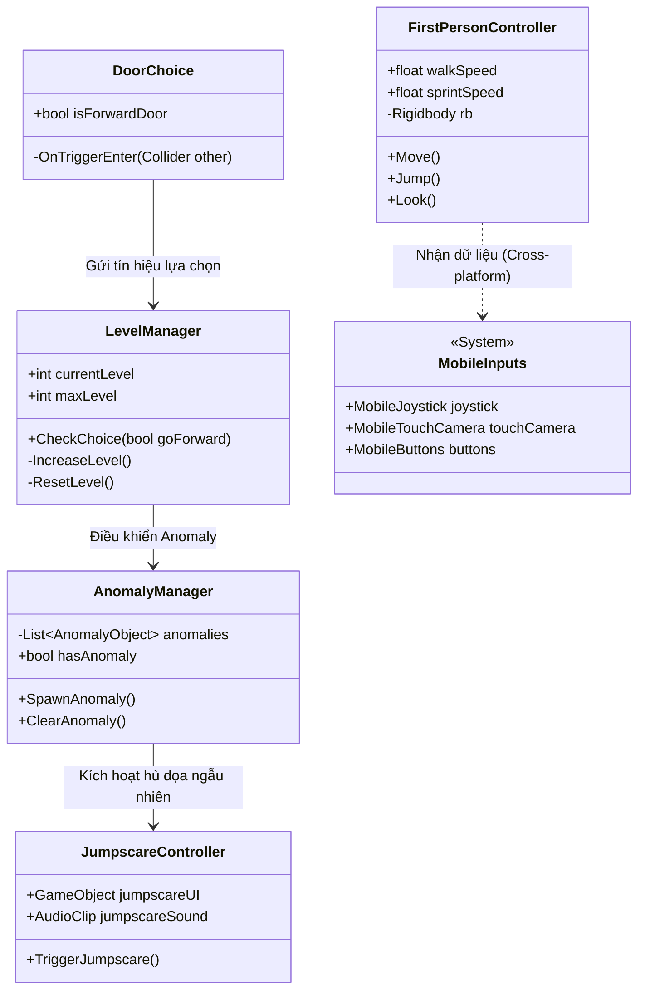

---

## 5. Sơ đồ Hệ thống / Kiến trúc Component (System Diagram)
Mô tả kiến trúc chia tách các Subsystem trong game (Điều khiển, Logic chính, Giao diện, Âm thanh).

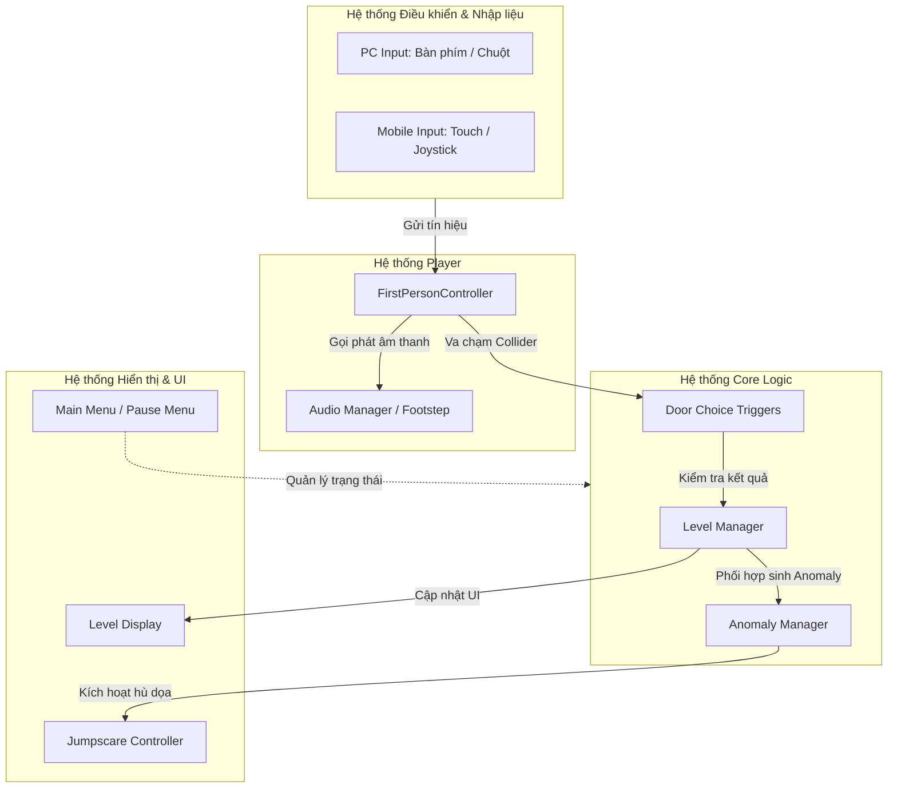

---

## 6. Sơ đồ Triển khai (Deployment Diagram)
Mô tả sơ đồ vật lý của ứng dụng khi được build và chạy trên thiết bị đầu cuối của người chơi (hỗ trợ cả PC & Mobile).

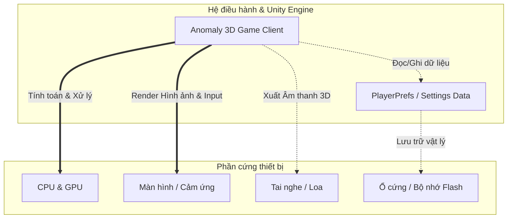

---

## 7. Sơ đồ Kiến trúc Component (Component-Based Architecture Diagram)
Mô hình Component-based là đặc trưng cốt lõi của các game engine như Unity. Sơ đồ này mô tả cách các thực thể (GameObjects) được lắp ráp từ các thành phần (Components) độc lập và cách các Component này giao tiếp với nhau để tạo nên logic game hoàn chỉnh.

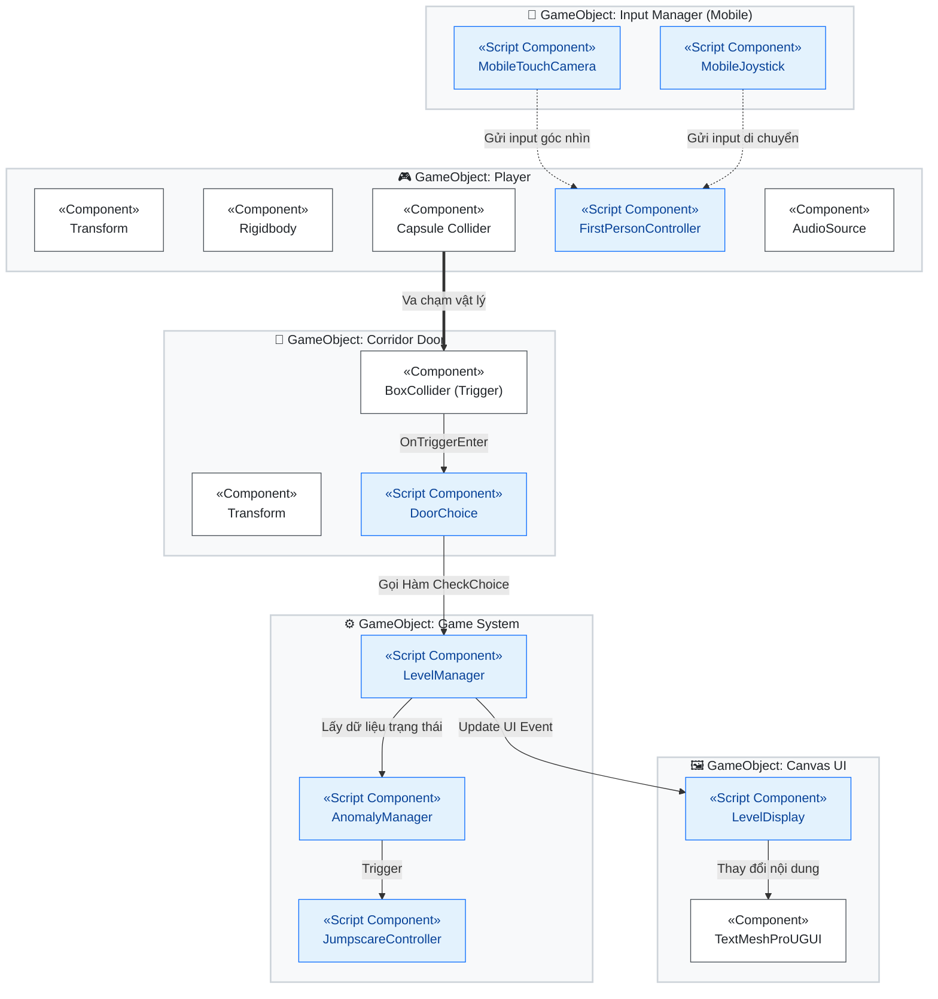

---

## 8. Sơ đồ Quy trình tạo PBR Texture (Materialize Workflow)
Quy trình (Workflow) sử dụng phần mềm **Bounding Box Materialize** để tạo ra một bộ Texture PBR (Physically Based Rendering) hoàn chỉnh từ một bức ảnh 2D cơ bản (Albedo/Diffuse). Quy trình này rất quan trọng để đưa vật liệu chân thực vào Unity.

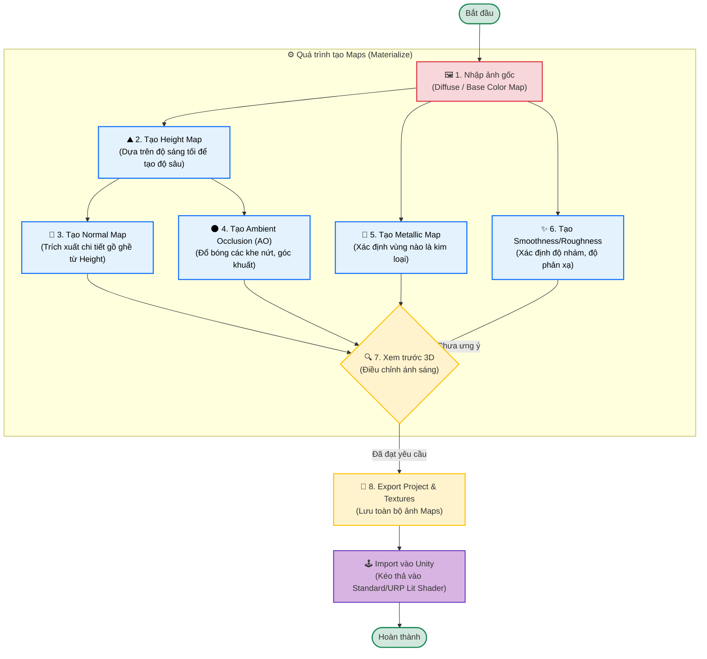

---

## 9. Sơ đồ Trạng thái Hoạt ảnh (Animation State Machine / Animator Controller)
Sơ đồ này mô tả hệ thống Animator Controller trong Unity dùng để điều khiển hoạt ảnh (Animation) của nhân vật hoặc các thực thể sống trong game. Sơ đồ này thể hiện sự chuyển đổi giữa các trạng thái cơ bản trên mặt đất như đứng yên, đi bộ, chạy và các trạng thái đặc biệt như bị hù dọa, dựa trên các tham số (Parameters) truyền vào từ script `FirstPersonController`.

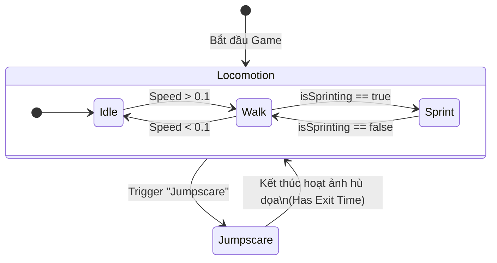

---

## 10. Sơ đồ Luồng Giao diện Menu (UI Flow Diagram)
Sơ đồ này mô tả sự điều hướng của người chơi qua các giao diện người dùng (UI) khác nhau trong game, từ màn hình chính (Main Menu), màn hình cài đặt (Settings), đến giao diện khi đang chơi (In-Game HUD) và màn hình tạm dừng (Pause Menu).

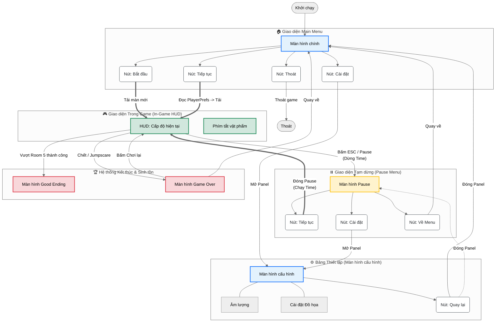

---

## 11. Sơ đồ Hoạt động Tạm dừng Game (Pause Menu Logic Diagram)
Sơ đồ này đi sâu vào logic lập trình đằng sau việc Tạm dừng (Pause) và Tiếp tục (Resume) game, đặc biệt quan trọng trong các game góc nhìn thứ nhất (FPS) khi cần xử lý thời gian (TimeScale), khóa/mở khóa con trỏ chuột (Cursor Lock) và vô hiệu hóa các Input của người chơi để tránh lỗi.

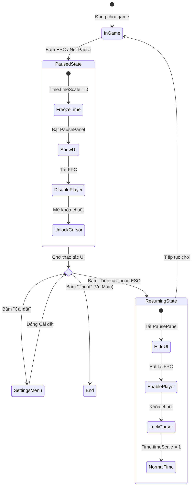
